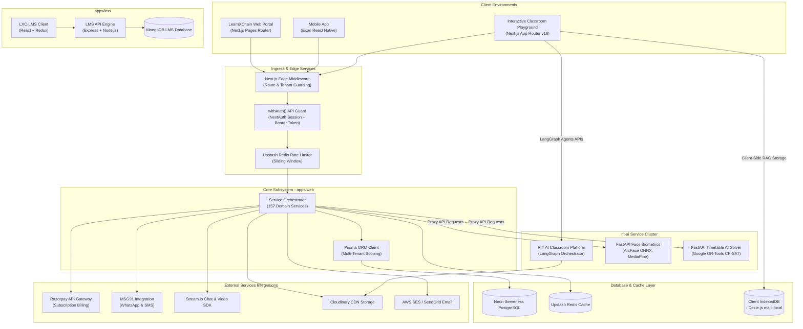
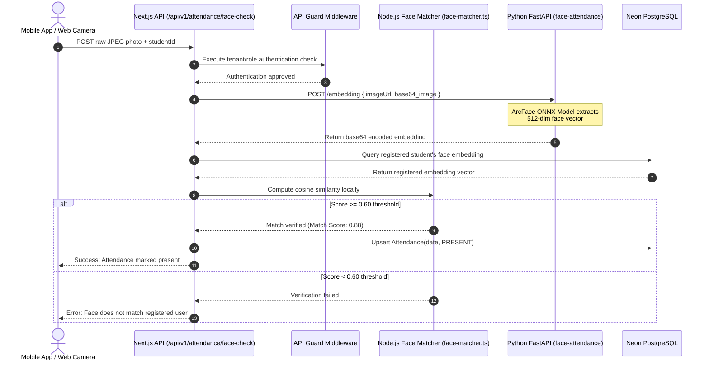
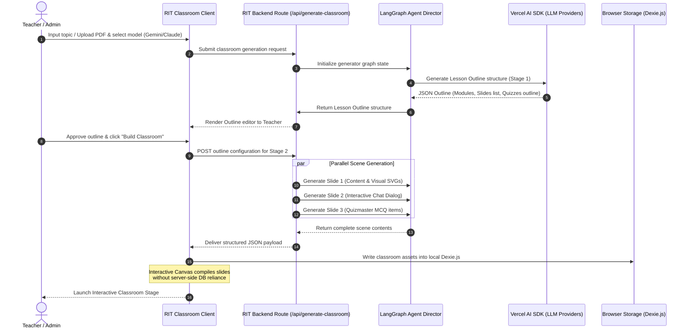

# LearnXChain — Production-Grade System Architecture & Design

This document provides a comprehensive, Google-grade system design specification for the **LearnXChain (LXC) SaaS Platform**. It covers the platform's multi-tenant architecture, six core sub-systems, modular service layer, database schema design, and production deployment topology.

---

## 1. System Architecture Blueprint

LearnXChain is designed as a modular, high-scale, multi-tenant school/college management platform featuring deep AI integration, live telemetry tracking, and an interactive learning playground.

### 1.1 High-Level Architecture Topology



### 1.2 System Sub-Systems Topology

The system comprises **six independent, highly coordinated sub-systems**:

| Sub-System | Repository / Folder Location | Purpose | Core Tech Stack | Dev Port |
|---|---|---|---|---|
| **Main Web SaaS App** | `apps/web` | Central multi-tenant dashboard & ERP for all roles | Next.js 16 (Pages Router), React 18, Tailwind CSS v3, Prisma, NextAuth.js | `3000` |
| **RIT AI Classroom** | `rit-ai/rit` | Advanced AI sandbox for lesson generation & interactive classrooms | Next.js 16 (App Router), React 19, Tailwind CSS v4, Zustand, Dexie.js, LangGraph | `5000` |
| **Face Recognition** | `rit-ai/face-attendance` | Biometric face embedding extraction and identity verification | FastAPI, ONNX Runtime (ArcFace ResNet-100), MediaPipe, OpenCV | `5002` |
| **Timetable AI Solver** | `rit-ai/timetableAi` | Constraint-based automated lesson schedule generator | FastAPI, Google OR-Tools (CP-SAT Solver) | `8000` |
| **Mobile App** | `lxc-app` | Cross-platform mobile portal for administrative and student functions | Expo SDK 54, React Native, Expo Router (File Routing), AsyncStorage | — |
| **LXC LMS Sub-app** | `lxc-lms` | Legacy standalone learning management system integration | MERN Stack (React 18 + Redux + Express 4 + MongoDB) | `3000` / `4000` |

---

## 2. Deep Dive: Six Core Sub-systems

### 2.1 Main Web Application (`apps/web`)
The cornerstone ERP handles multi-tenant operations, scheduling, billing, tracking, and student affairs.
- **Architectural Pattern**: Service-oriented layered architecture. API handlers (`pages/api/v1/`) are decoupled thin controllers that delegate complex logic to transactional domain service classes (`lib/services/`).
- **Database Access Strategy**: Single-instance Prisma Client with PostgreSQL connection pooling. All database queries made on behalf of a tenant strictly enforce schema segregation using a `schoolId` filter.
- **Performance Optimization**: Upstash Redis is used for API rate limiting and server-side caching of slow analytical queries. React Query handles optimistic frontend mutations and data caching on client portals.

### 2.2 RIT AI Interactive Classroom (`rit-ai/rit`)
A client-first learning playground where AI agents present dynamic lessons, build quizzes, and moderate student debates.
- **Agent Orchestration**: Powered by **LangGraph** (multi-agent orchestration layer) defining a **Director Graph** state machine. This Director acts as the hub coordinates five specialized worker agents (Presenter, Critic, Scribe, Quizmaster, PBL Advisor).
- **Two-Stage Generation Pipeline**:
  - **Stage 1 (Outline Generation)**: Analyzes the user-selected topic or uploaded PDF and outputs a high-level Lesson Outline structure (JSON format).
  - **Stage 2 (Scene Rendering)**: Uses parallel LLM requests to generate slide contents, LaTeX equations, SVGs, real-time quizzes, and simulated interactive chat threads.
- **Browser-Native Database**: Dexie.js (IndexedDB wrapper) stores full interactive states (slides, scripts, whiteboard operations, local audio voiceovers) directly in the browser (`maic-local` DB), avoiding server round-trip latency.

### 2.3 Face Recognition Biometric Service (`rit-ai/face-attendance`)
A high-throughput computer vision microservice designed to support frictionless student and teacher attendance check-ins.
- **Biometric Processing Pipeline**:
  - **Face Detection**: Uses **MediaPipe** as the primary detection mechanism (fast, low CPU overhead) with an OpenCV Haar Cascade fallback system.
  - **Embedding Extraction**: Normalizes face regions and feeds them through an **ArcFace ResNet-100** deep learning model in **ONNX Runtime** format to generate a dense, normalized 512-dimension float32 vector embedding.
- **Node.js Local Validation Trick**: To minimize network latency, the Python FastAPI microservice is *only* called to extract vectors from raw images during check-in. The actual mathematical comparison (cosine similarity calculation) is executed locally inside the Next.js service layer using `lib/utils/face-matcher.ts`.

### 2.4 Timetable AI Constraint Solver (`rit-ai/timetableAi`)
A combinatorial optimization microservice implementing constraint-satisfaction heuristics to automate master timetable generation.
- **Optimization Engine**: Built on **Google OR-Tools CP-SAT Solver** (Constraint Programming - Satisfiability).
- **Core Hard Constraints**:
  - **Teacher Collision**: A single teacher cannot occupy more than one classroom per time slot.
  - **Classroom Overlap**: A single class cohort cannot be assigned to multiple subjects or rooms in the same time slot.
  - **Room Double-Booking**: A physical room cannot hold multiple class cohorts concurrently.
- **Soft Constraints (Preferences)**:
  - **Teacher Priority Slots**: Teacher time-slot preferences are given custom positive weights inside the objective optimization function.
  - **Balanced Workload**: Spreads subject periods evenly across the academic week.

### 2.5 Expo Mobile Application (`lxc-app`)
A React Native shell built with Expo, providing a dedicated client-side portal for students, teachers, parents, and transportation drivers.
- **Routing Engine**: Leverages Expo Router file-based routing.
- **Security Protocol**: A custom Bearer Token Authentication mechanism. The login action requests `/api/v1/auth/mobile-login`, extracts a custom JSON Web Token, and stores it in device `AsyncStorage`. The custom Axios API wrapper (`lxc-app/lib/api.ts`) intercepts outbound requests and injects the authorization header.

### 2.6 LMS Sub-system (`lxc-lms`)
An independent learning environment integrating React + Redux clients with an Express/MongoDB backend service, supporting course enrollments, chapter milestones, and assignments.

---

## 3. Database Architecture & ER Modeling

The main PostgreSQL schema (`prisma/schema.prisma`) comprises **211 models** and **102 enums** configured for strict tenant isolation and highly indexed transactional lookups.

### 3.1 Multi-Tenant Isolation Strategy
All transactional models (e.g., `Student`, `Teacher`, `Class`, `Subject`, `Attendance`, `FeeStructure`, `Bus`) implement a direct foreign key relation to the `School` model. 

```prisma
// Example Prisma Schema Scoping Rule
model Student {
  id             String       @id @default(cuid())
  admissionNum   String       @unique
  schoolId       String
  school         School       @relation(fields: [schoolId], references: [id], onDelete: Cascade)
  user           User         @relation(fields: [userId], references: [id])
  userId         String       @unique
  classId        String
  class          Class        @relation(fields: [classId], references: [id])
  isActive       Boolean      @default(true)
  
  @@index([schoolId])
  @@index([schoolId, isActive])
}
```

### 3.2 Core Entity Relationship Model (Modular Map)

```
                     ┌──────────────────────┐
                     │     Superadmin       │
                     └──────────┬───────────┘
                                │ Configures
                                ▼
                     ┌──────────────────────┐
                     │        School        │
                     └──────────┬───────────┘
                                │ Contains 
        ┌───────────────────────┼───────────────────────┐
        ▼                       ▼                       ▼
┌──────────────┐        ┌──────────────┐        ┌──────────────┐
│     User     │◄───────┤    Class     ├───────►│   Subject    │
└───────┬──────┘        └───────┬──────┘        └───────┬──────┘
        │                       │                       │
        ├───────────────────────┼───────────────────────┤
        │ Extends               │ Schedules             │ Instructs
        ▼                       ▼                       ▼
┌──────────────┐        ┌──────────────┐        ┌──────────────┐
│   Student    │◄───────┤    Lesson    ├───────►│   Teacher    │
└───────┬──────┘        └───────┬──────┘        └──────────────┘
        │                       │
        │ Marks                 │ Records
        ▼                       ▼
┌──────────────┐        ┌──────────────┐
│  Attendance  │◄───────┤  Assignment  │
└──────────────┘        └──────────────┘
```

- **Core User Model & Extensibility**: The `User` table serves as the polymorphic base entity. Realized roles (e.g. `Student`, `Teacher`, `Employee`) have 1-to-1 relationships back to the primary `User` record to ensure shared login credentials and global authentication configurations.
- **Relational Integrity**:
  - `School` has many `User`, `Class`, `Subject`, `Student`, `Teacher`.
  - `Class` has many `Student` and `Subject` associations, one assigned class `Teacher`, and many `Lesson` slots.
  - `Student` holds multiple `Attendance` instances and is linked to a single `StudentFeePlan`.
  - `Payment` links directly to a `StudentFeePlan` and registers transaction records in the `FinanceLedger`.

---

## 4. Key Cross-Service Integration Workflows

### 4.1 Biometric Attendance Verification Pipeline



### 4.2 Automated Lesson & Slides Generation Flow



---

## 5. Deployment Topology & Infrastructure

```
                                    Internet
                                       │
                                       ▼
                       ┌──────────────────────────────┐
                       │      Vercel Ingress Edge     │
                       └──────────────┬───────────────┘
                                      │
           ┌──────────────────────────┼──────────────────────────┐
           │ Next.js Rewrite Rules    │ Web App Routing          │ AI Classroom Root
           ▼                          ▼                          ▼
┌──────────────────────┐   ┌──────────────────────┐   ┌──────────────────────┐
│  Face Biometrics API │   │ Main Next.js App     │   │ RIT AI Classroom     │
│  (Vercel Serverless) │   │ (Multi-tenant SaaS)  │   │ (Standalone Vercel)  │
│  api/face.py         │   │ apps/web             │   │ rit-ai/rit           │
└──────────┬───────────┘   └──────────┬───────────┘   └──────────────────────┘
           │                          │
           │ Downloads model          ├──────────────────────────┐
           ▼ (ephemeral)              │ Prisma Queries           │ Cache Requests
┌──────────────────────┐   ┌──────────▼───────────┐   ┌──────────▼───────────┐
│     Vercel /tmp/     │   │ Neon DB PostgreSQL   │   │ Upstash Redis Cache  │
│     ONNX Model Cache │   │ (Serverless Pooler)  │   │ (Connection Pooler)  │
└──────────────────────┘   └──────────────────────┘   └──────────────────────┘
```

- **Vercel Serverless Architecture**:
  - The Web App (`apps/web`) and the RIT AI Classroom platform (`rit-ai/rit`) are deployed as independent Vercel projects configured with custom reverse proxy rewrite rules (using `vercel.json` configurations).
  - FastAPI services (`face-attendance` and `timetableAi`) are written to execute natively as **Vercel Python Serverless Functions** (`api/face.py` and `api/timetable.py`). ONNX models are loaded into Vercel’s transient `/tmp/` disk storage upon function initialization to circumvent strict serverless bundle limits.
- **Self-Hosted Docker Orchestration (Fallback)**:
  For non-serverless private network rollouts, a unified multi-stage `Dockerfile` compiles both FastAPI microservices. A python orchestrator (`run_all.py`) serves the Face recognition API on port `5002` and the Timetable Solver on port `8000` concurrently under a single container configuration.
- **Neon Serverless PostgreSQL Pooler**:
  Ensures the multi-tenant transactional engine scales gracefully under load spikes by using transaction-level connection pooling to handle high-frequency Prisma queries without exhausting database capacity.

---

## 6. Security, Rate Limiting & Enterprise Controls

### 6.1 Authentication Integration (Hybrid Strategy)
- **Web Session Guard**: Leverages NextAuth.js configured with a JWT strategy (30-day session lifespan). Edge middleware verifies cookies and resolves routing gates prior to executing Next.js page generation.
- **Mobile Bearer Auth**: Intercepts REST calls via a custom edge gateway. If an authorization header (`Authorization: Bearer <jwt>`) is provided, NextAuth verification is bypassed and custom JWT decoding populates the request context with user and tenant details.

### 6.2 Subscription Control Gates
All non-superadmin API endpoints are protected by `withAuth()`. The API Guard dynamically executes `detectModule(req.url)` and calls `SubscriptionService.checkAccess(schoolId)`. If a school's trial or recurring subscription is expired, the request is blocked and returns an HTTP `402 Payment Required` payload, preventing access to the module.

### 6.3 Enterprise Middleware Stack
- **Audit Logs**: The custom `audit-log.ts` middleware intercepts mutative API operations (POST, PUT, DELETE), captures payload state transitions, and creates persistent immutable logs of administrative actions.
- **Sliding-Window Rate Limiting**: Interfaced with Upstash Redis, restricting high-frequency endpoint calls on a per-ip and per-tenant index basis to secure the platform against denial-of-service threats.
