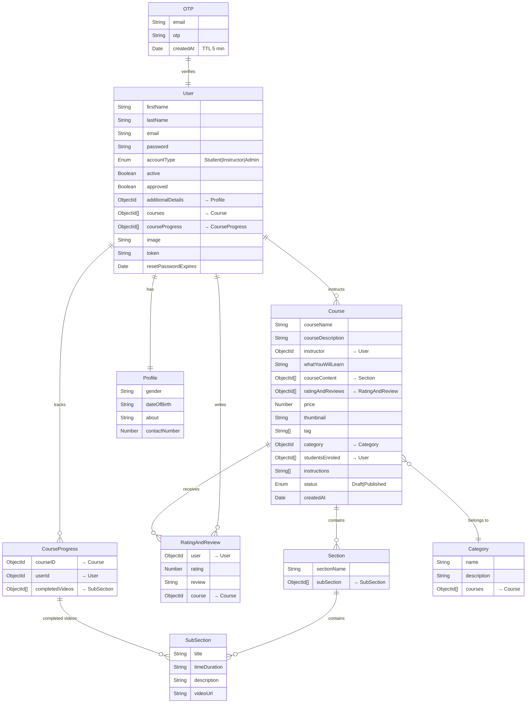
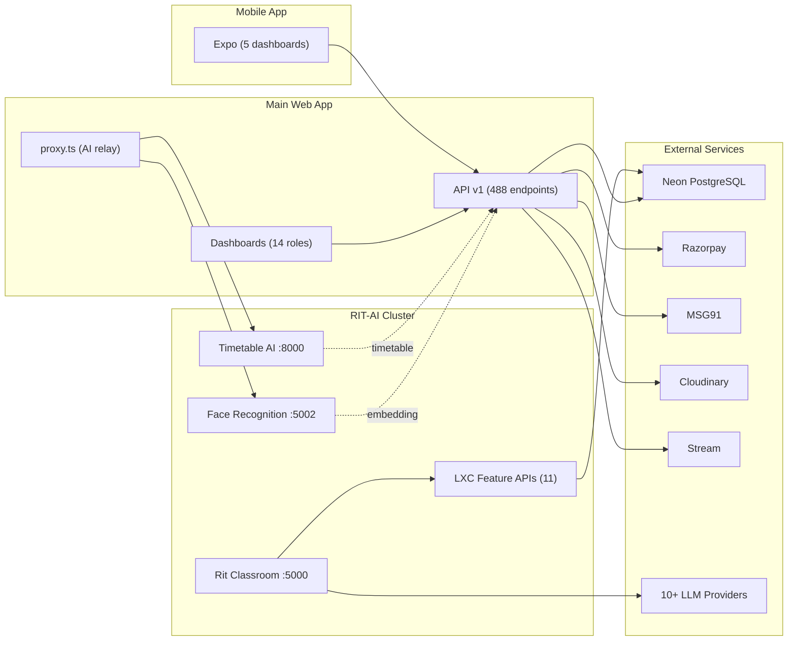

# LearnXChain — Technical Project Report

| | |
|---|---|
| **Document ID** | LXC-TPR-2026-001 |
| **Classification** | Internal / Engineering |
| **Author** | Rajneesh Rana |
| **Created** | 2026-04-07 |
| **Last Updated** | 2026-04-07 |
| **Platform Version** | 0.1.0 |
| **Status** | Production |

### Revision History

| Rev | Date | Author | Changes |
|---|---|---|---|
| 1.0 | 2026-04-07 | Rajneesh Rana | Initial comprehensive audit — all 6 sub-systems documented |
| 1.1 | 2026-04-07 | Rajneesh Rana | Deep-dive LXC-LMS module, version breakdown, data flows |
| 1.2 | 2026-04-07 | Rajneesh Rana | Security architecture, observability, performance, conventions, technical debt |

---

### Table of Contents

1. [Executive Summary](#1-executive-summary)
2. [Architecture Overview](#2-architecture-overview)
3. [Main Web Application](#3-main-web-application)
4. [RIT-AI Service Cluster](#4-rit-ai-service-cluster)
5. [Rit — AI Interactive Classroom](#5-rit--ai-interactive-classroom)
6. [Mobile Application](#6-mobile-application)
7. [LXC-LMS Module — Deep Dive](#7-lxc-lms-module)
8. [DevOps & Deployment](#8-devops--deployment)
9. [Environment Variables](#9-environment-variables)
10. [Integration Points](#10-integration-points)
11. [Key File Size Reference](#11-key-file-size-reference)
12. [Platform Version Breakdown & Evolution](#12-platform-version-breakdown--evolution)
13. [Data Flow & Request Lifecycle](#13-data-flow--request-lifecycle)
14. [Security Architecture](#14-security-architecture)
15. [Observability, Logging & Monitoring](#15-observability-logging--monitoring)
16. [Performance & Caching Strategy](#16-performance--caching-strategy)
17. [Third-Party Service Dependency Matrix](#17-third-party-service-dependency-matrix)
18. [Testing Strategy](#18-testing-strategy)
19. [Coding Conventions & Standards](#19-coding-conventions--standards)
20. [Known Limitations & Technical Debt](#20-known-limitations--technical-debt)
21. [Glossary](#21-glossary)
22. [Summary Statistics](#22-summary-statistics)
23. [Quick Reference — Running Each Sub-System](#23-quick-reference)

---


## 1. Executive Summary

LearnXChain (LXC) is an enterprise-grade **School/College Management SaaS platform** with integrated **AI-powered interactive classroom** capabilities. The platform spans **6 interconnected sub-systems** deployed across multiple environments:

| Sub-System | Tech Stack | Deployment | Port |
|---|---|---|---|
| **Main Web App** (LXC Dashboard) | Next.js 16, React 18, Prisma 7, PostgreSQL | Vercel + Neon DB | 3000 |
| **RIT AI Classroom** (rit-ai/rit) | Next.js 16, React 19, Zustand, LangGraph | Vercel | 5000 |
| **Face Recognition Service** (rit-ai/face-attendance) | FastAPI, ONNX Runtime, ArcFace, OpenCV | Docker / Vercel Serverless | 5002 |
| **Timetable AI Solver** (rit-ai/timetableAi) | FastAPI, Google OR-Tools, CP-SAT | Docker / Vercel Serverless | 8000 |
| **Mobile App** (lxc-app) | Expo React Native, File-based Routing | EAS Build (iOS + Android) | — |
| **LXC-LMS** (lxc-lms) | React 18, Redux, Express 4, MongoDB | Vercel + Render | 3000 + 4000 |

### Key Metrics at a Glance

| Metric | Count |
|---|---|
| Prisma DB Models | **211** |
| Prisma Enums | **102** |
| API Endpoints (v1) | **488 files** across 30 domain modules |
| Dashboard Pages | **211 `.tsx` files** across 14 role-based portals |
| Service Layer Files | **157 files** (32 root + 15 sub-directories) |
| UI Components | **171 `.tsx` files** across 14 component categories |
| Rit AI API Routes | **39 route handlers** across 22 endpoint groups |
| Rit LXC Feature APIs | **11 AI feature endpoints** |
| Mobile App Dashboards | **5 role dashboards** (admin, teacher, student, parent, driver) |
| LXC-LMS Source Files | **140 files** (102 client + 38 server) |
| LXC-LMS MongoDB Models | **9 collections** (User, Course, Section, etc.) |
| LXC-LMS API Endpoints | **35+** across 5 route modules |
| Schema File Size | **190 KB** (single source of truth) |

---

## 2. Architecture Overview

```
┌──────────────────────────────────────────────────────────────────────────────┐
│                          LearnXChain Platform                                │
│                                                                              │
│  ┌─────────────────────────────────────────────────────┐                    │
│  │             Main Web App (Next.js 16)               │                    │
│  │  ┌──────────┐ ┌──────────┐ ┌──────────┐ ┌───────┐  │                    │
│  │  │ Landing  │ │Dashboard │ │API v1    │ │Auth   │  │                    │
│  │  │ Pages    │ │14 Roles  │ │30 Modules│ │NextAuth│  │                    │
│  │  └──────────┘ └──────────┘ └──────────┘ └───────┘  │                    │
│  │  ┌──────────────────────────────────────────────┐   │                    │
│  │  │ Service Layer (157 files) → Prisma ORM       │   │                    │
│  │  └────────────────────┬─────────────────────────┘   │                    │
│  └───────────────────────┼─────────────────────────────┘                    │
│                          │                                                   │
│                    ┌─────▼─────┐                                            │
│                    │  Neon DB  │ PostgreSQL (211 models, 102 enums)          │
│                    └───────────┘                                            │
│                                                                              │
│  ┌─────────────────────────────────────────────────────┐                    │
│  │             RIT-AI Service Cluster                   │                    │
│  │                                                      │                    │
│  │  ┌──────────────────────────────────────────────┐   │                    │
│  │  │  Rit Interactive Classroom (Next.js 16)      │   │                    │
│  │  │  • Multi-Agent LangGraph Orchestration       │   │                    │
│  │  │  • Slide/Quiz/PBL/Interactive Generation     │   │                    │
│  │  │  • 10+ LLM Providers (OpenAI, Claude, etc.)  │   │                    │
│  │  │  • TTS/ASR, Whiteboard, PPTX Export          │   │                    │
│  │  │  • 11 LXC Feature API Extensions             │   │                    │
│  │  └──────────────────────────────────────────────┘   │                    │
│  │                                                      │                    │
│  │  ┌──────────────┐      ┌─────────────────┐          │                    │
│  │  │Face Recog.   │      │Timetable Solver │          │                    │
│  │  │ArcFace+ONNX  │      │OR-Tools CP-SAT  │          │                    │
│  │  │Port 5002     │      │Port 8000        │          │                    │
│  │  └──────────────┘      └─────────────────┘          │                    │
│  └─────────────────────────────────────────────────────┘                    │
│                                                                              │
│  ┌──────────────────┐   ┌──────────────────┐                                │
│  │  Mobile App      │   │  LXC-LMS Module  │                                │
│  │  Expo (RN)       │   │  (Standalone LMS) │                                │
│  │  5 Role Dashboards│  │  React + Express  │                                │
│  └──────────────────┘   └──────────────────┘                                │
└──────────────────────────────────────────────────────────────────────────────┘
```

---

## 3. Main Web Application (`/`)

### 3.1 Technology Stack

| Layer | Technology | Version |
|---|---|---|
| Framework | Next.js (Pages Router) | ^16.0.0 |
| UI | React | ^18.3.1 |
| Language | TypeScript | ^5.3.3 |
| Styling | Tailwind CSS | ^3.4.1 |
| Database | Prisma ORM → Neon PostgreSQL | ^7.1.0 |
| Auth | NextAuth.js (JWT strategy) | ^4.24.13 |
| State | React Query (@tanstack) | ^5.90.21 |
| Animation | Framer Motion | ^11.18.2 |
| Icons | Lucide React | ^0.562.0 |
| Charts | Recharts + Chart.js | ^3.7.0 / ^4.5.0 |
| Maps | Leaflet + React-Leaflet | ^1.9.4 |
| Real-time | Socket.IO + Stream Chat | ^4.8.1 / ^9.11.0 |
| Video Calls | Stream Video React SDK | ^1.19.0 |
| Payments | Razorpay | ^2.9.5 |
| File Upload | Multer + Multiparty + Cloudinary | Various |
| PDF Gen | PDFKit + jsPDF + Puppeteer | Various |
| Email | AWS SES + SendGrid + Nodemailer | Various |
| SMS/WhatsApp | MSG91 + Twilio | Various |
| Cache | Upstash Redis + ioredis | Various |
| Logging | Winston | ^3.13.0 |
| Validation | Zod | ^3.25.76 |

### 3.2 File Structure Overview

```
/
├── pages/                          # Next.js pages (Pages Router)
│   ├── _app.tsx                    # Provider stack (Auth, Query, Theme, Toast)
│   ├── _document.tsx               # HTML shell
│   ├── index.tsx                   # Landing page (ISR)
│   ├── login.tsx                   # Login (20KB)
│   ├── create-superadmin.tsx       # Platform bootstrap (27KB)
│   ├── forgot-password.tsx         # Password reset flow
│   ├── reset-password.tsx          # Reset confirmation
│   ├── profile.tsx                 # User profile
│   ├── about.tsx                   # Company info
│   ├── ai.tsx                      # AI features page
│   ├── book-demo.tsx               # Demo booking
│   ├── contact.tsx                 # Contact page
│   ├── solutions.tsx               # Solutions showcase
│   ├── product.tsx                 # Product page
│   ├── services.tsx                # Services page
│   ├── resources.tsx               # Resources page
│   ├── projects.tsx                # Projects showcase
│   ├── privacy.tsx                 # Privacy policy (13KB)
│   ├── terms.tsx                   # Terms of service (11KB)
│   ├── cookies.tsx                 # Cookie policy (7KB)
│   ├── components.tsx              # Component showcase (6KB)
│   ├── sitemap.xml.ts              # Dynamic XML sitemap
│   ├── 404.tsx                     # Custom 404
│   ├── _error.tsx                  # Error boundary
│   │
│   ├── api/                        # API Routes
│   │   ├── auth/                   # NextAuth endpoints
│   │   ├── create-superadmin.ts    # Bootstrap API
│   │   ├── v1/                     # Versioned API (30 domain modules)
│   │   ├── cron/                   # Scheduled jobs
│   │   ├── diag/                   # Diagnostics
│   │   └── users/                  # User management
│   │
│   ├── dashboard/                  # 14 Role-Based Dashboards
│   │   ├── admin/                  # School admin panel
│   │   ├── superadmin/             # Platform management
│   │   ├── group-admin/            # Multi-branch management
│   │   ├── teacher/                # Teacher portal
│   │   ├── student/                # Student portal
│   │   ├── parent/                 # Parent portal
│   │   ├── employee/               # HRM portal
│   │   ├── staff/                  # Staff portal
│   │   ├── hostel/                 # Hostel warden
│   │   ├── library/                # Librarian
│   │   ├── transport/              # Transport manager
│   │   ├── driver/                 # Driver portal
│   │   ├── academics/              # Academic role
│   │   ├── forum/                  # Forum
│   │   └── profile.tsx             # Shared profile (15KB)
│   │
│   ├── careers/                    # Career pages
│   ├── debug/                      # Debug tools
│   ├── forum/                      # Forum pages
│   ├── meet/                       # Video meeting
│   ├── register/                   # Registration
│   └── verify/                     # Email/phone verification
│
├── components/                     # 171 React Components
│   ├── dashboard/                  # Dashboard layout + sidebar config (30KB)
│   ├── home/                       # Landing page sections
│   ├── ui/                         # Base primitives (buttons, cards, tables, modals)
│   ├── common/                     # Shared components
│   ├── seo/                        # SEO components
│   ├── about/                      # About page sections
│   ├── ai/                         # AI page sections
│   ├── book-demo/                  # Demo booking components
│   ├── contact/                    # Contact form
│   ├── product/                    # Product components
│   ├── projects/                   # Project cards
│   ├── resources/                  # Resource components
│   ├── services/                   # Service components
│   └── solutions/                  # Solution components
│
├── lib/                            # Core Business Logic
│   ├── auth.ts                     # NextAuth config (11KB)
│   ├── prisma.ts                   # Prisma client singleton (7KB)
│   ├── brand-colors.ts             # Brand color constants
│   ├── config.ts                   # App config (1.5KB)
│   ├── module-metadata.ts          # Module metadata registry
│   ├── middleware/                  # API guards, rate limiting, CORS, audit
│   ├── services/                   # 157 service files across 15 sub-dirs
│   ├── validations/                # Zod schemas for all modules
│   ├── utils/                      # 20+ utility files
│   ├── context/                    # React contexts (AuthContext)
│   ├── config/                     # Config sub-modules
│   ├── constants/                  # App constants
│   ├── cache/                      # Cache utilities
│   ├── cron-jobs/                  # Scheduled job definitions
│   ├── db/                         # DB utility helpers
│   ├── performance/                # Performance monitoring
│   ├── seo/                        # SEO utilities
│   ├── templates/                  # Email/notification templates
│   └── api/                        # API utilities
│
├── hooks/                          # Custom React Hooks
│   ├── useApi.ts                   # API fetch hook (5KB)
│   ├── useLocation.ts              # Geolocation hook
│   └── useTheme.tsx                # Theme provider + dark mode
│
├── prisma/
│   ├── schema.prisma               # 190KB — 211 models, 102 enums
│   └── migrations/                 # Database migration history
│
├── styles/                         # Global CSS
├── types/                          # TypeScript declarations
├── scripts/                        # 20 utility scripts (seed, optimize, verify)
├── public/                         # Static assets
├── assets/                         # Source assets
├── docs/                           # Documentation
├── views/                          # Email/template views
├── logs/                           # Winston log output
│
├── Dockerfile                      # Multi-stage Docker build (Node 20 Alpine)
├── next.config.js                  # Next.js config (3KB)
├── tailwind.config.js              # Custom brand theme (1.7KB)
├── tsconfig.json                   # TypeScript config
├── package.json                    # 77 dependencies + 29 devDependencies
└── proxy.ts                        # AI service proxy (6.5KB)
```

### 3.3 API Domain Modules (`pages/api/v1/`) — 30 Domains, 488 Files

| # | Domain | Path | Key Operations |
|---|---|---|---|
| 1 | **Academic** | `v1/academic/` | Classes, subjects, sections, exams, syllabus |
| 2 | **Account** | `v1/account/` | Accountant role operations |
| 3 | **Admin** | `v1/admin/` | Admin-scoped operations, school settings |
| 4 | **AI** | `v1/ai/` | AI integrations, smart recommendations |
| 5 | **AI Timetable** | `v1/ai-timetable/` | Auto-generated timetables via OR-Tools |
| 6 | **Analytics** | `v1/analytics/` | Reports, dashboards, data aggregation |
| 7 | **Attendance** | `v1/attendance/` | Check-in/out, face attendance, bulk marking |
| 8 | **Auth** | `v1/auth/` | Login, register, mobile auth, JWT |
| 9 | **Careers** | `v1/careers/` | Career/placement management |
| 10 | **Communication** | `v1/communication/` | Notices, WhatsApp, SMS, email templates |
| 11 | **Daily** | `v1/daily/` | Daily student activities, homework logs |
| 12 | **Dashboard** | `v1/dashboard/` | Dashboard statistics APIs |
| 13 | **Demo** | `v1/demo/` | Demo/trial session management |
| 14 | **Employee** | `v1/employee/` | HRM, payroll, leave management |
| 15 | **Finance** | `v1/finance/` | Fees, invoices, payments (Razorpay), receipts |
| 16 | **Forum** | `v1/forum/` | Discussion forums, threads, replies |
| 17 | **Group Admin** | `v1/group-admin/` | Multi-branch management |
| 18 | **Hostel** | `v1/hostel/` | Rooms, allocation, outpass, hostel fees |
| 19 | **Leads** | `v1/leads/` | Enquiry/lead pipeline, follow-ups |
| 20 | **Library** | `v1/library/` | Books, issue/return, fines, catalog |
| 21 | **Notification** | `v1/notification/` | Push notifications, email alerts |
| 22 | **Onboarding** | `v1/onboarding/` | School setup wizard |
| 23 | **Project** | `v1/project/` | Project management, tasks |
| 24 | **Public** | `v1/public/` | Public-facing APIs (no auth) |
| 25 | **Student** | `v1/student/` | Student CRUD, profiles, bulk upload |
| 26 | **Superadmin** | `v1/superadmin/` | Platform management, schools, plans, features |
| 27 | **Teacher** | `v1/teacher/` | Teacher CRUD, assignments, class mapping |
| 28 | **Transport** | `v1/transport/` | Routes, GPS, drivers, trips, geofencing |
| 29 | **User** | `v1/user/` | User profile, preferences |
| 30 | **Verify** | `v1/verify/` | Email/phone verification |

### 3.4 Service Layer (`lib/services/`) — 157 Files

**Root-Level Services (32 files):**

| Service File | Size | Purpose |
|---|---|---|
| `student-service.ts` | 18KB | Student CRUD, bulk operations |
| `performance-service.ts` | 16KB | Student/teacher analytics |
| `onboarding-service.ts` | 16KB | School setup wizard |
| `library-service.ts` | 14KB | Book catalog, issue/return |
| `student-dashboard-service.ts` | 14KB | Student portal dashboard |
| `teacher-service.ts` | 8KB | Teacher CRUD, class assignments |
| `transport-service.ts` | 8KB | Routes, stops, assignments |
| `user-service.ts` | 7KB | User profiles, roles |
| `trip-service.ts` | 7KB | Live trips, GPS tracking |
| `student-leaderboard-service.ts` | 7KB | Gamification leaderboard |
| `attendance-service.ts` | 7KB | Attendance tracking |
| `msg91-template-service.ts` | 6KB | MSG91 template management |
| `daily-activity-service.ts` | 6KB | Daily student activities |
| `msg91-service.ts` | 5KB | WhatsApp/SMS via MSG91 |
| `leads-service.ts` | 5KB | Lead/enquiry management |
| `transport-notification.ts` | 5KB | Transport alerts |
| `academic-activity-service.ts` | 4KB | Assignments, activities |
| `driver-behavior-service.ts` | 4KB | Driver safety scoring |
| `emailService.ts` | 4KB | Email dispatch |
| `bulk-upload-job-service.ts` | 4KB | Bulk CSV/Excel uploads |
| `academic-service.ts` | 4KB | Classes, subjects, sections |
| `password-service.ts` | 3KB | Password reset/change |
| `notification.ts` | 3KB | Push notification dispatch |
| `school-service.ts` | 3KB | School settings, config |
| `stream-sync.ts` | 3KB | Stream.io user sync |
| `account-service.ts` | 3KB | Accountant operations |
| `DemoService.ts` | 3KB | Demo session management |
| `location-service.ts` | 2KB | Geolocation/geofencing |
| `student-id-card-service.ts` | 2KB | ID card generation |
| `student-roadmap-service.ts` | 2KB | Learning roadmap |
| `sms-service.ts` | 1KB | SMS dispatch |
| `whatsapp-service.ts` | 1KB | WhatsApp messaging |

**Sub-Directory Services (15 directories):**

| Directory | Purpose |
|---|---|
| `admin/` | Admin-specific services |
| `analytics/` | Analytics/reporting services |
| `common/` | Shared/reusable services |
| `communication/` | Communication services |
| `dashboard/` | Dashboard aggregation |
| `finance/` | Fee, invoice, payment services |
| `hostel/` | Hostel management |
| `notification/` | Notification services |
| `project/` | Project management |
| `reports/` | Report generation |
| `student/` | Student-scoped sub-services |
| `superadmin/` | Platform-level admin |
| `teacher/` | Teacher-scoped sub-services |
| `timetable/` | Timetable generation |
| `transport/` | Transport sub-services |

### 3.5 Database Layer — Prisma

| Metric | Value |
|---|---|
| Schema file | `prisma/schema.prisma` |
| File size | **190,781 bytes (190 KB)** |
| Models | **211** |
| Enums | **102** |
| Provider | PostgreSQL (Neon) |
| Adapter | `@prisma/adapter-pg` |
| Accelerate | `@prisma/extension-accelerate` |

### 3.6 Security & Middleware

| Component | File | Purpose |
|---|---|---|
| API Guard | `lib/middleware/api-guard.ts` | `withAuth()` HOF, `detectModule()`, subscription check |
| Rate Limiting | `lib/middleware/rate-limit.ts` | Upstash Redis rate limiting |
| CORS | `lib/middleware/cors.ts` | Cross-origin configuration |
| Cron Guard | `lib/middleware/cron-guard.ts` | Cron job protection |
| Audit Log | `lib/middleware/audit-log.ts` | Audit trail middleware |
| Edge Middleware | `middleware.ts` | Next.js edge route protection |

### 3.7 Role Hierarchy

```
superadmin > group_admin > admin > teacher > staff > student > parent > driver
```

14 role-based dashboard portals with role-specific sidebar configurations defined in `dashboardConfig.ts` (30KB).

---

## 4. RIT-AI Service Cluster (`/rit-ai/`)

The AI services layer comprises **3 independent microservices** + a unified orchestrator.

### 4.1 Service Architecture

```
rit-ai/
├── api/                            # Vercel Serverless Functions (Python)
│   ├── face.py                     # Face Recognition API (Vercel edge)
│   └── timetable.py                # Timetable Solver API (Vercel edge)
│
├── face-attendance/                # Standalone Face Recognition Service
│   ├── main_app.py                 # FastAPI app (257 lines, 8.9KB)
│   ├── requirements.txt            # Python dependencies
│   ├── model11/                    # Pre-trained face.js model weights
│   │   ├── face_recognition_model.bin    (6.4MB)
│   │   ├── ssd_mobilenetv1_model.bin     (5.6MB)
│   │   ├── age_gender_model.bin          (429KB)
│   │   ├── face_expression_model.bin     (329KB)
│   │   ├── face_landmark_68_model.bin    (356KB)
│   │   ├── face_landmark_68_tiny_model.bin (77KB)
│   │   └── tiny_face_detector_model.bin  (193KB)
│   └── src/services/               # Service abstractions
│
├── timetableAi/                    # Standalone Timetable Solver
│   ├── app/
│   │   ├── main.py                 # FastAPI app entry
│   │   ├── schema.py               # Pydantic request models
│   │   ├── solver/
│   │   │   ├── solver.py           # OR-Tools solve entry
│   │   │   ├── model.py            # CP-SAT model builder
│   │   │   └── constraints.py      # Constraint definitions
│   │   └── helper/                 # Helper utilities
│   └── requirements.txt            # Python dependencies
│
├── rit/                            # 🔥 Full AI Classroom Platform (see §5)
│
├── run_all.py                      # Multi-service process launcher
├── Dockerfile                      # Multi-stage Docker (Python 3.10)
├── build-docker.bat                # Windows Docker build script
├── start.bat                       # Windows startup script
├── index.html                      # Service status landing page
├── vercel.json                     # Vercel rewrite rules
├── requirements.txt                # Combined Python dependencies
├── .env.example                    # Environment variables template
└── .dockerignore                   # Docker ignore rules
```

### 4.2 Face Recognition Service (`face-attendance/`)

| Attribute | Value |
|---|---|
| **Framework** | FastAPI (Python) |
| **Detection** | MediaPipe (primary) → OpenCV Haar Cascade (fallback) |
| **Embedding** | ArcFace ResNet-100 via ONNX Runtime |
| **Model download** | Auto-downloads from HuggingFace on first request |
| **Model size** | ~120MB ArcFace ONNX |
| **Threshold** | 0.6 cosine similarity |
| **Port** | 5002 |

**API Endpoints:**

| Method | Path | Description |
|---|---|---|
| `GET` | `/health` | Health check (returns detector type) |
| `GET` | `/ready` | Model readiness check |
| `POST` | `/embedding` | Extract face embedding from image (Base64 or URL) |
| `POST` | `/match-embeddings` | Compare two Base64 embeddings, return match score |

**Vercel Edge Variant (`api/face.py`):**
- Same logic, adapted for serverless (downloads model to `/tmp/models/`)
- Routes: `/api/face/health`, `/api/face/embedding`, `/api/face/match-embeddings`

### 4.3 Timetable AI Solver (`timetableAi/`)

| Attribute | Value |
|---|---|
| **Framework** | FastAPI (Python) |
| **Solver** | Google OR-Tools CP-SAT |
| **Constraints** | Teacher conflict, room conflict, class conflict, teacher preferences |
| **Port** | 8000 |

**API Endpoints:**

| Method | Path | Description |
|---|---|---|
| `GET` | `/health` | Health check |
| `POST` | `/generate-timetable` | Generate collision-free timetable from class/subject/teacher data |

**Input Schema:**
```python
class TimetableRequest:
    payload: Dict[str, Any]       # classes, rooms, days, timeSlots
    teacherPreferences: Dict[str, List[str]]  # teacher → preferred time slots
```

**Vercel Edge Variant (`api/timetable.py`):**
- Self-contained solver optimized for serverless
- Route: `/api/timetable/generate-timetable`, `/api/timetable/health`

### 4.4 Docker Deployment

The `Dockerfile` defines a **4-stage build**:

| Stage | Purpose | Image |
|---|---|---|
| `base` | Python 3.10 + system libs (gcc, OpenCV deps) | `python:3.10-slim` |
| `face-service` | Face Recognition standalone | Extends `base` |
| `timetable-service` | Timetable Solver standalone | Extends `base` |
| `runtime` | Combined runtime (both services) | Extends `base` |

**Health checks**: Every 30s, 10s timeout, 3 retries.
**Entry point**: `python run_all.py` (launches both services in parallel).

---

## 5. Rit — AI Interactive Classroom (`/rit-ai/rit/`)

Rit is a **large, standalone Next.js 16 application** that transforms any topic or document into an immersive, multi-agent interactive classroom experience.

### 5.1 Technology Stack

| Layer | Technology | Version |
|---|---|---|
| Framework | Next.js (App Router) | 16.1.2 |
| UI | React | 19.2.3 |
| Language | TypeScript | ^5 |
| Styling | Tailwind CSS v4 | ^4 |
| State | Zustand + Immer | ^5.0.10 |
| AI SDK | Vercel AI SDK | ^6.0.42 |
| Orchestration | LangGraph (LangChain) | ^1.1.1 |
| LLM Providers | OpenAI, Anthropic, Google Gemini + 7 more | Various |
| Agent Framework | CopilotKit | ^1.51.2 |
| Math | KaTeX | ^0.16.33 |
| Charts | ECharts | ^6.0.0 |
| Rich Editor | ProseMirror (full stack) | ^1.4.4 |
| Client DB | Dexie.js (IndexedDB) | ^4.2.1 |
| Node Graph | XY Flow | ^12.10.0 |
| Export | pptxgenjs (workspace) + mathml2omml | Custom |
| Package Manager | pnpm (monorepo) | ^10.26.1 |

### 5.2 Full File Structure

```
rit/
├── app/                                    # Next.js App Router
│   ├── page.tsx                            # Home page — classroom list (47KB)
│   ├── layout.tsx                          # Root layout
│   ├── globals.css                         # Global CSS + Tailwind theme (8.5KB)
│   │
│   ├── api/                                # 22 API Route Groups
│   │   ├── generate-classroom/             # Async classroom job submission + polling
│   │   ├── generate/                       # General AI content generation
│   │   ├── chat/                           # Multi-agent SSE streaming chat
│   │   ├── quiz-grade/                     # Real-time AI quiz grading
│   │   ├── pbl/                            # PBL project generation + Q&A
│   │   ├── parse-pdf/                      # PDF upload + text/image extraction
│   │   ├── transcription/                  # Audio speech-to-text
│   │   ├── web-search/                     # Web search proxy (Tavily, Exa, Bocha)
│   │   ├── proxy-media/                    # Media URL proxying (CORS bypass)
│   │   ├── classroom-media/                # Media generation for scenes
│   │   ├── azure-voices/                   # Azure TTS voice list
│   │   ├── server-providers/               # Server-configured AI providers
│   │   ├── verify-model/                   # API key + model validation
│   │   ├── verify-image-provider/          # Image provider validation
│   │   ├── verify-video-provider/          # Video provider validation
│   │   ├── verify-pdf-provider/            # PDF provider validation
│   │   ├── health/                         # Service health check
│   │   ├── lesson-companion/               # Interactive lesson assistance
│   │   ├── homework-assist/                # Homework help AI
│   │   ├── exam-evaluate/                  # Exam answer evaluation
│   │   │
│   │   └── lxc/                            # 🔥 11 LXC Feature Extensions
│   │       ├── adaptive-quiz/              # Adaptive quiz generation
│   │       ├── career-discovery/           # Career path discovery
│   │       ├── cognitive/                  # Cognitive assessment
│   │       ├── communication-coach/        # Communication skills trainer
│   │       ├── decision-simulator/         # Decision-making simulator
│   │       ├── digital-twin/               # Student digital twin
│   │       ├── life-skills/                # Life skills training
│   │       ├── projects/                   # Project-based API
│   │       ├── study-roadmap/              # Personalized study roadmap
│   │       ├── talent/                     # Talent assessment
│   │       └── wellness/                   # Student wellness tracking
│   │
│   ├── classroom/[id]/                     # Dynamic classroom playback page
│   ├── generation-preview/                 # Scene generation preview
│   │
│   └── lxc/                                # 🔥 LXC Student Portal (17 modules)
│       ├── page.tsx                         # LXC dashboard home (18KB)
│       ├── layout.tsx                       # LXC layout wrapper
│       ├── analytics/                       # Learning analytics
│       ├── avatar/                          # AI avatar customization
│       ├── bharat/                          # Bharat education module
│       ├── career/                          # Career guidance
│       ├── certificates/                    # Certificate management
│       ├── communication/                   # Communication tools
│       ├── decision/                        # Decision-making training
│       ├── digital-twin/                    # Student digital twin
│       ├── gamification/                    # Gamification features
│       ├── life-skills/                     # Life skills modules
│       ├── parent/                          # Parent portal view
│       ├── peers/                           # Peer collaboration
│       ├── performance/                     # Performance tracking
│       ├── projects/                        # Student projects
│       ├── study-plan/                      # Study plan management
│       ├── talent/                          # Talent discovery
│       └── wellness/                        # Wellness tracking
│
├── components/                             # React UI Components (15 dirs + 4 files)
│   ├── stage.tsx                           # Main classroom stage (37KB)
│   ├── header.tsx                          # Top navigation (14KB)
│   ├── user-profile.tsx                    # User profile (9KB)
│   ├── server-providers-init.tsx           # Server provider init
│   ├── slide-renderer/                     # Canvas-based slide editor & renderer
│   ├── scene-renderers/                    # Quiz, Interactive, PBL renderers
│   ├── canvas/                             # Interactive editing canvas
│   ├── generation/                         # Outline editor, type selectors
│   ├── chat/                               # Chat panel & messages
│   ├── settings/                           # Settings panel (model, TTS, ASR)
│   ├── whiteboard/                         # SVG-based shared whiteboard
│   ├── agent/                              # Agent avatar, config, info
│   ├── audio/                              # Audio recording/playback
│   ├── roundtable/                         # Multi-agent debate display
│   ├── stage/                              # Stage management
│   ├── ai-elements/                        # AI-specific UI elements
│   ├── lxc/                                # LXC-specific components
│   └── ui/                                 # Base UI primitives (shadcn/ui + Radix)
│
├── lib/                                    # Core Business Logic (25 dirs)
│   ├── ai/                                 # LLM Provider Abstraction
│   │   ├── providers.ts                    # 10+ provider configs (31KB)
│   │   ├── llm.ts                          # LLM call abstraction (13KB)
│   │   └── thinking-context.ts             # Thinking context management
│   │
│   ├── generation/                         # Two-Stage Lesson Pipeline
│   │   ├── pipeline-runner.ts              # Pipeline orchestrator (3.3KB)
│   │   ├── outline-generator.ts            # Stage 1: outline from topic (7.5KB)
│   │   ├── scene-generator.ts              # Stage 2: scene content (43KB!) 
│   │   ├── scene-builder.ts                # Scene assembly (6.6KB)
│   │   ├── action-parser.ts                # Parse agent actions (5.6KB)
│   │   ├── json-repair.ts                  # Fix malformed AI JSON (5.7KB)
│   │   ├── interactive-post-processor.ts   # Interactive content processing (5.2KB)
│   │   ├── prompt-formatters.ts            # Prompt formatting (6KB)
│   │   ├── pipeline-types.ts               # Pipeline type defs
│   │   ├── generation-pipeline.ts          # Pipeline config
│   │   └── prompts/                        # AI prompt templates (Markdown)
│   │
│   ├── orchestration/                      # Multi-Agent LangGraph Director
│   │   ├── director-graph.ts               # LangGraph state machine (19KB)
│   │   ├── prompt-builder.ts               # Agent prompt construction (39KB!)
│   │   ├── stateless-generate.ts           # Stateless generation (15KB)
│   │   ├── director-prompt.ts              # Director system prompt (11KB)
│   │   ├── ai-sdk-adapter.ts               # Vercel AI SDK adapter (4.4KB)
│   │   ├── tool-schemas.ts                 # Tool schemas (4.5KB)
│   │   └── registry/                       # Agent registry + defaults
│   │
│   ├── playback/                           # Classroom Playback Engine
│   │   ├── engine.ts                       # State machine (25KB)
│   │   ├── derived-state.ts                # Computed state (7KB)
│   │   ├── types.ts                        # Playback types
│   │   └── index.ts                        # Exports
│   │
│   ├── action/
│   │   └── engine.ts                       # Action execution engine (17KB)
│   │
│   ├── store/                              # Zustand State Stores (9 files)
│   │   ├── settings.ts                     # User settings (40KB!)
│   │   ├── canvas.ts                       # Slide editor state (14KB)
│   │   ├── stage.ts                        # Classroom state (10KB)
│   │   ├── media-generation.ts             # Media job queue (7KB)
│   │   ├── snapshot.ts                     # Undo/redo (5.3KB)
│   │   ├── whiteboard-history.ts           # Whiteboard history (2.9KB)
│   │   ├── user-profile.ts                 # User profile (1.1KB)
│   │   ├── keyboard.ts                     # Keyboard bindings
│   │   └── index.ts                        # Exports
│   │
│   ├── audio/                              # TTS & ASR Providers (8 files)
│   │   ├── tts-providers.ts                # TTS adapters (11KB)
│   │   ├── asr-providers.ts                # ASR adapters (12KB)
│   │   ├── constants.ts                    # Voice/language config (23KB)
│   │   ├── azure.json                      # Azure voice catalog (432KB, 500+ voices)
│   │   ├── types.ts                        # Audio types (5.3KB)
│   │   ├── tts-utils.ts                    # Audio helpers
│   │   ├── browser-tts-preview.ts          # Browser TTS preview
│   │   └── use-tts-preview.ts              # TTS preview hook
│   │
│   ├── media/                              # Image & Video Generation
│   │   ├── media-orchestrator.ts           # Generation orchestrator (10KB)
│   │   ├── image-providers.ts              # Image gen adapters
│   │   ├── video-providers.ts              # Video gen adapters
│   │   ├── types.ts                        # Media types (11KB)
│   │   └── adapters/                       # Provider adapters
│   │
│   ├── export/                             # PPTX & HTML Export
│   │   ├── use-export-pptx.ts              # PowerPoint pipeline (43KB!)
│   │   ├── latex-to-omml.ts                # LaTeX → OOXML
│   │   ├── svg-path-parser.ts              # SVG path parsing
│   │   ├── svg2base64.ts                   # SVG to Base64
│   │   └── html-parser/                    # HTML parsing
│   │
│   ├── pbl/                                # Project-Based Learning
│   │   ├── generate-pbl.ts                 # PBL generation (18KB)
│   │   ├── pbl-system-prompt.ts            # PBL agent prompts (10KB)
│   │   ├── types.ts                        # PBL types
│   │   └── mcp/                            # MCP integration
│   │
│   ├── hooks/                              # Custom React Hooks (12 files)
│   │   ├── use-scene-generator.ts          # Scene generation (19KB)
│   │   ├── use-canvas-operations.ts        # Canvas editing (18KB)
│   │   ├── use-audio-recorder.ts           # Audio recording (10KB)
│   │   ├── use-order-element.ts            # Element ordering (7.5KB)
│   │   ├── use-browser-asr.ts              # Browser ASR
│   │   ├── use-browser-tts.ts              # Browser TTS
│   │   ├── use-streaming-text.ts           # Streaming text
│   │   ├── use-draft-cache.ts              # Draft caching
│   │   ├── use-theme.tsx                   # Theme management
│   │   ├── use-i18n.tsx                    # Internationalization
│   │   ├── use-slide-background-style.ts   # Slide backgrounds
│   │   └── use-history-snapshot.ts         # History snapshots
│   │
│   ├── i18n/                               # Internationalization (7 files, 64KB settings)
│   │   ├── settings.ts                     # i18n settings (64KB!)
│   │   ├── generation.ts                   # Generation strings
│   │   ├── chat.ts                         # Chat strings
│   │   ├── stage.ts                        # Stage strings
│   │   ├── common.ts                       # Common strings
│   │   ├── index.ts                        # i18n bootstrap
│   │   └── types.ts                        # i18n types
│   │
│   ├── types/                              # TypeScript Definitions (12 files)
│   │   ├── slides.ts                       # Slide element types (17KB)
│   │   ├── chat.ts                         # Chat types (9KB)
│   │   ├── action.ts                       # Action types (7KB)
│   │   ├── generation.ts                   # Generation types (7KB)
│   │   └── 8 more type definition files
│   │
│   ├── utils/                              # Utilities (14 files)
│   │   ├── database.ts                     # Dexie IndexedDB (14KB)
│   │   ├── element.ts                      # Element utilities (8KB)
│   │   ├── stage-storage.ts                # Stage persistence (7KB)
│   │   ├── audio-player.ts                 # Audio playback (5.5KB)
│   │   ├── image-storage.ts                # Image persistence (5.2KB)
│   │   ├── geometry.ts                     # Geometry calculations
│   │   ├── chat-storage.ts                 # Chat persistence
│   │   ├── playback-storage.ts             # Playback state
│   │   └── 6 more utility files
│   │
│   ├── web-search/                         # Web Search (Tavily, Exa, Bocha)
│   ├── pdf/                                # PDF Parsing (unpdf, MinerU, Custom)
│   ├── lxc/                                # LXC student store
│   ├── prosemirror/                        # ProseMirror rich text
│   ├── server/                             # Server-side utilities
│   ├── storage/                            # CDN storage provider
│   ├── buffer/                             # Buffer utilities
│   ├── chat/                               # Chat logic
│   ├── constants/                          # Constants
│   ├── contexts/                           # React contexts
│   ├── api/                                # API facade
│   └── logger.ts                           # Client-side logger
│
├── configs/                                # Static Configuration (13 files)
│   ├── shapes.ts                           # Shape definitions (77KB!)
│   ├── symbol.ts                           # Symbol library (29KB)
│   ├── latex.ts                            # LaTeX presets (8.2KB)
│   ├── animation.ts                        # Animation configs (7.6KB)
│   ├── image-clip.ts                       # Image clipping (6.5KB)
│   ├── hotkey.ts                           # Keyboard shortcuts (5KB)
│   ├── theme.ts                            # Theme definitions
│   ├── chart.ts                            # Chart presets
│   ├── font.ts                             # Font configuration
│   ├── lines.ts                            # Line styles
│   ├── element.ts                          # Element defaults
│   ├── mime.ts                             # MIME types
│   └── storage.ts                          # Storage config
│
├── packages/                               # Workspace Packages
│   ├── pptxgenjs/                          # Custom PowerPoint generation library
│   └── mathml2omml/                        # MathML → OOXML converter
│
├── skills/                                 # OpenClaw Integration Skills
│   └── openmaic/                           # Rit classroom generation SOP
│
├── community/                              # Community Links
│   └── feishu.md                           # Feishu community link
│
├── public/                                 # Static assets (logos, icons, avatars)
├── assets/                                 # Source media (GIFs, screenshots)
├── attached_assets/                        # README assets
│
├── lxc.md                                  # Full feature & use case guide (17KB)
├── techstack.md                            # Tech stack reference (15KB)
├── README.md                               # Project README (16KB)
├── next.config.ts                          # Next.js config
├── pnpm-workspace.yaml                     # Monorepo workspace config
├── docker-compose.yml                      # Docker composition
├── Dockerfile                              # Container build
├── eslint.config.mjs                       # ESLint config
├── components.json                         # shadcn/ui config
├── vercel.json                             # Vercel deployment rules
├── tsconfig.json                           # TypeScript config
├── postcss.config.mjs                      # PostCSS config
├── .prettierrc                             # Prettier config
├── .nvmrc                                  # Node version (20)
└── package.json                            # 96 dependencies (4KB)
```

### 5.3 Supported AI Providers (10+)

| Provider | Models | Key |
|---|---|---|
| **OpenAI** | GPT-4o, GPT-4o-mini, O1, O3 | `OPENAI_API_KEY` |
| **Anthropic** | Claude 3.5 Sonnet/Haiku, Opus | `ANTHROPIC_API_KEY` |
| **Google** | Gemini 1.5/2.0 Pro/Flash | `GOOGLE_API_KEY` |
| **DeepSeek** | DeepSeek Chat/Reasoner | `DEEPSEEK_API_KEY` |
| **GLM (Zhipu)** | GLM-4, GLM-4-Flash | `GLM_API_KEY` |
| **Qwen (Alibaba)** | Qwen Max/Turbo/Plus | `QWEN_API_KEY` |
| **Kimi (Moonshot)** | Moonshot v1 8K/32K | `KIMI_API_KEY` |
| **MiniMax** | ABAB 6.5/5.5 | `MINIMAX_API_KEY` |
| **SiliconFlow** | RIT models | `SILICONFLOW_API_KEY` |
| **Doubao** | Doubao Pro/Lite | `ARK_API_KEY` |
| **Custom** | Any OpenAI-compatible API | Configurable |

### 5.4 Multi-Agent Classroom System

**6 Default AI Agents:**

| Agent | Role | Priority |
|---|---|---|
| Teacher | Leads lessons, narrates slides | Highest |
| AI Assistant Teacher | Teaching assistant, fills gaps | High |
| Class Clown (क्लास जोकर) | Humor and energy | Medium |
| Curious Learner (जिज्ञासु) | Deep "why" questions | Medium |
| Note Taker (नोट लेखक) | Structured summarization | Medium |
| Deep Thinker (गहरा सोचने वाला) | Cross-connects ideas | Medium |

**28+ Action Types**: Speech, spotlight, whiteboard draw/text/shape/chart, discussion, quiz trigger, laser pointer, and more.

### 5.5 Scene Types

| Type | Description |
|---|---|
| **Slide** | AI-generated slides with text, images, charts, shapes, LaTeX |
| **Quiz** | MCQ, multi-select, short answer with AI grading |
| **Interactive** | Self-contained HTML simulations |
| **Interactive (Scientific)** | Complex scientific model simulations |
| **PBL** | Project-based learning with roles, tasks, milestones |

### 5.6 Client-Side Storage (Dexie IndexedDB)

| Table | Key | Purpose |
|---|---|---|
| `stages` | `id` | Classroom metadata |
| `scenes` | `id` | Slides, quizzes, PBL, interactive |
| `audioFiles` | `id` | TTS audio blobs |
| `imageFiles` | `id` | Uploaded images |
| `mediaFiles` | compound | AI-generated media |
| `chatSessions` | `id` | Full AI chat history |
| `playbackState` | `stageId` | Last playback position |
| `stageOutlines` | `stageId` | Resume-on-refresh outlines |
| `snapshots` | auto | Undo/redo history |
| `generatedAgents` | `id` | Classroom agent configs |

---

## 6. Mobile Application (`/lxc-app/`)

### 6.1 Technology Stack

| Layer | Technology |
|---|---|
| Framework | Expo (React Native) |
| Routing | File-based routing (expo-router) |
| API Client | Custom fetch + Bearer token |
| Build | EAS Build (iOS + Android) |

### 6.2 File Structure

```
lxc-app/
├── app/                            # Expo file-based routing
│   ├── _layout.tsx                 # Root layout (5.4KB)
│   ├── index.tsx                   # App entry/splash (5KB)
│   ├── login.tsx                   # Login screen (8.7KB)
│   ├── forgot-password.tsx         # Password recovery (9KB)
│   ├── +not-found.tsx              # 404 handling
│   ├── +native-intent.tsx          # Deep linking
│   │
│   ├── dashboard/                  # Role-Based Dashboards
│   │   ├── admin/                  # Admin dashboard
│   │   ├── teacher.tsx             # Teacher dashboard (17.7KB)
│   │   ├── student.tsx             # Student dashboard (26.4KB)
│   │   ├── parent.tsx              # Parent dashboard (20.9KB)
│   │   └── driver.tsx              # Driver dashboard (18.5KB)
│   │
│   └── pages/                      # Additional pages
│
├── components/                     # Mobile-specific components
├── lib/
│   └── api.ts                      # API client (fetch + Bearer token)
├── constants/                      # Mobile constants/config
├── shared/                         # Shared code between web/mobile
├── assets/                         # Images, fonts, icons
├── patches/                        # Native module patches
├── scripts/                        # Build/utility scripts
│
├── app.json                        # Expo configuration (1.5KB)
├── eas.json                        # EAS Build configuration
├── metro.config.js                 # Metro bundler config
├── babel.config.js                 # Babel config
├── tsconfig.json                   # TypeScript config
├── package.json                    # 3.1KB
└── ADMIN_DASHBOARD_PRD.md          # Admin dashboard PRD (9KB)
```

---

## 7. LXC-LMS Module (`/lxc-lms/`) — Deep Dive

A standalone, full-stack **MERN-based Learning Management System** (originally named "EdUniHub") that provides a complete e-learning marketplace where instructors create courses and students purchase, consume, and rate them. This is an independent sub-project with its own backend, database, and frontend.

### 7.1 Technology Stack

**Frontend (Client):**

| Layer | Technology | Version |
|---|---|---|
| Framework | React (CRA) | ^18.2.0 |
| State Management | Redux Toolkit | ^1.9.5 |
| Routing | React Router DOM | ^6.9.0 |
| Styling | Tailwind CSS | ^3.2.7 |
| HTTP Client | Axios | ^1.3.5 |
| Charts | Chart.js + react-chartjs-2 | ^4.3.0 |
| Forms | React Hook Form | ^7.43.9 |
| Notifications | React Hot Toast | ^2.4.0 |
| Icons | React Icons | ^4.8.0 |
| Markdown | React Markdown + Showdown | ^8.0.7 |
| File Upload | React Dropzone | ^14.2.3 |
| OTP Input | React OTP Input | ^3.0.0 |
| Ratings | React Rating Stars | ^2.2.0 |
| Carousel | Swiper | ^9.3.1 |
| Video Player | Video React | ^0.16.0 |
| Progress Bars | @ramonak/react-progress-bar | ^5.0.3 |
| Type Animation | React Type Animation | ^3.0.1 |
| Responsive Tables | react-super-responsive-table | ^5.2.1 |
| Clipboard | copy-to-clipboard | ^3.3.3 |

**Backend (Server):**

| Layer | Technology | Version |
|---|---|---|
| Runtime | Node.js + Express | ^4.18.2 |
| Database | MongoDB (Mongoose ODM) | ^7.0.3 |
| Auth | JWT (jsonwebtoken) | ^9.0.0 |
| Password | Bcrypt + Bcryptjs | ^5.1.0 |
| File Uploads | express-fileupload | ^1.4.0 |
| Media CDN | Cloudinary | ^1.36.4 |
| Payments | Razorpay | ^2.8.6 |
| Email | Nodemailer (Gmail SMTP) | ^6.9.1 |
| OTP | otp-generator | ^4.0.1 |
| Scheduling | node-schedule | ^2.1.1 |
| Environment | dotenv | ^16.0.3 |

### 7.2 Complete File Structure (140 source files: 102 client + 38 server)

```
lxc-lms/
├── .env                                    # Client BASE_URL config
├── .gitignore                              # Git ignore rules
├── README.md                               # EdUniHub project docs (4KB)
├── package.json                            # 29 deps + 4 devDeps (2KB)
├── tailwind.config.js                      # Custom color palette (3.1KB)
│
├── public/                                 # Static Public Assets
│   ├── index.html                          # HTML entry (1.5KB)
│   ├── manifest.json                       # PWA manifest
│   ├── robots.txt                          # Crawler rules
│   ├── favicon.ico                         # Site icon
│   ├── logo.png                            # App logo (3.5KB)
│   ├── logo192.png                         # PWA icon 192px
│   ├── logo512.png                         # PWA icon 512px
│   └── _redirects                          # Netlify SPA redirects
│
├── src/                                    # 🔵 React Frontend (102 files)
│   ├── index.js                            # React entry — Redux Provider + BrowserRouter
│   ├── App.jsx                             # Main router — 20+ routes (5.4KB)
│   ├── App.css                             # Global styles (4.7KB)
│   │
│   ├── assets/                             # Static Media Assets
│   │   ├── Images/                         # 18 files (banners, backgrounds, illustrations)
│   │   │   ├── banner.mp4                  # Hero video (2.7MB)
│   │   │   ├── Instructor.png             # Instructor hero (415KB)
│   │   │   ├── TimelineImage.png          # Timeline illustration (572KB)
│   │   │   ├── FoundingStory.png          # About page image (176KB)
│   │   │   ├── Compare_with_others.png/svg # Feature illustrations
│   │   │   ├── Know_your_progress.png/svg  # Feature illustrations
│   │   │   ├── Plan_your_lessons.png/svg   # Feature illustrations
│   │   │   ├── aboutus1/2/3.webp          # About page photos
│   │   │   ├── login.webp / signup.webp   # Auth page images
│   │   │   ├── frame.png                  # Decorative frame
│   │   │   ├── boxoffice.png              # Analytics illustration
│   │   │   └── bghome.svg                 # Background pattern
│   │   ├── Logo/                           # 6 logo variants
│   │   │   ├── Logo-Full-Dark.png         # Full dark logo
│   │   │   ├── Logo-Full-Light.png        # Full light logo
│   │   │   ├── Logo-Small-Dark.png        # Small dark logo
│   │   │   ├── Logo-Small-Light.png       # Small light logo
│   │   │   ├── l.png                      # Favicon source
│   │   │   └── rzp_logo.png              # Razorpay branding (66KB)
│   │   └── TimeLineLogo/                   # 4 timeline SVG icons
│   │       ├── Logo1.svg → Logo4.svg      # Leadership, Vision, etc.
│   │
│   ├── data/                               # Static Configuration Data
│   │   ├── dashboard-links.js              # Sidebar nav links (role-gated)
│   │   ├── navbar-links.js                 # Top nav links (Home, Catalog, About, Contact)
│   │   ├── homepage-explore.js             # Home explore tabs data (4.9KB)
│   │   ├── footer-links.js                # Footer link columns
│   │   └── countrycode.json                # Country codes for phone (11.6KB)
│   │
│   ├── utils/                              # Utility Functions
│   │   ├── constants.js                    # ACCOUNT_TYPE (Student|Instructor|Admin), COURSE_STATUS
│   │   ├── avgRating.js                    # Calculate average course rating
│   │   └── dateFormatter.js                # Format dates for display
│   │
│   ├── hooks/                              # Custom React Hooks
│   │   ├── useOnClickOutside.js            # Detect clicks outside element (1.2KB)
│   │   └── useRouteMatch.js                # Match current route
│   │
│   ├── reducer/
│   │   └── index.js                        # Root reducer (combines 5 slices)
│   │
│   ├── slices/                             # Redux Toolkit Slices (5)
│   │   ├── authSlice.js                    # Auth state: signupData, loading, token
│   │   ├── profileSlice.js                 # Profile state: user, loading
│   │   ├── courseSlice.js                   # Course state: step, course, editCourse
│   │   ├── cartSlice.js                    # Cart state: cart[], total, totalItems (localStorage)
│   │   └── viewCourseSlice.js              # View course: courseSectionData, currentVideo, progress
│   │
│   ├── services/                           # API Communication Layer
│   │   ├── apiConnector.js                 # Axios instance wrapper
│   │   ├── apis.js                         # ALL API endpoint URLs (71 lines, 3.6KB)
│   │   ├── formatDate.js                   # Date formatting utility
│   │   └── operations/                     # Redux Thunk Operations (6 files)
│   │       ├── authAPI.js                  # Login, signup, sendOTP, logout (5KB)
│   │       ├── courseDetailsAPI.js          # Full CRUD for courses/sections/subsections (12KB)
│   │       ├── profileAPI.js               # Get user details, enrolled courses (2.7KB)
│   │       ├── studentFeaturesAPI.js        # Razorpay payment flow (4.2KB)
│   │       ├── SettingsAPI.js              # Update profile, picture, password, delete (3.7KB)
│   │       └── pageAndComponntDatas.js      # Fetch page-level data (0.8KB)
│   │
│   ├── pages/                              # Page-Level Components (13 pages)
│   │   ├── Home.jsx                        # Landing page with hero, features, reviews (8KB)
│   │   ├── About.jsx                       # About company (6.5KB)
│   │   ├── Catalog.jsx                     # Course category listing (4.9KB)
│   │   ├── CourseDetails.jsx               # Full course detail page (10KB)
│   │   ├── Dashboard.jsx                   # Dashboard layout wrapper
│   │   ├── ViewCourse.jsx                  # Course player layout (1.9KB)
│   │   ├── Login.jsx                       # Login page wrapper
│   │   ├── Signup.jsx                      # Signup page wrapper
│   │   ├── VerifyEmail.jsx                 # OTP verification (3.5KB)
│   │   ├── ForgotPassword.jsx              # Password reset request (2.6KB)
│   │   ├── UpdatePassword.jsx              # Set new password (4.4KB)
│   │   ├── Contact.jsx                     # Contact us page (1.1KB)
│   │   └── Error.jsx                       # 404 page
│   │
│   └── components/                         # Reusable Components
│       ├── Common/                         # Shared UI (7 files)
│       │   ├── Navbar.jsx                  # Top navigation bar (6KB)
│       │   ├── Footer.jsx                  # Site footer (6.8KB)
│       │   ├── ReviewSlider.jsx            # Review carousel (3.7KB)
│       │   ├── ConfirmationModal.jsx       # Reusable confirm dialog (1KB)
│       │   ├── RatingStars.jsx             # Star rating component (1.1KB)
│       │   ├── Tab.jsx                     # Tab switcher component
│       │   └── IconBtn.jsx                 # Icon button primitive
│       │
│       └── core/                           # Feature Components (8 domains)
│           ├── Auth/                       # Authentication (6 files)
│           │   ├── LoginForm.jsx           # Email/password login (2.6KB)
│           │   ├── SignupForm.jsx          # Multi-step signup (6.2KB)
│           │   ├── Template.jsx            # Auth page template (1.8KB)
│           │   ├── OpenRoute.jsx           # Public-only route guard
│           │   ├── PrivateRoute.jsx        # Authenticated route guard
│           │   └── ProfileDropdown.jsx     # User menu dropdown (2.2KB)
│           │
│           ├── HomePage/                   # Landing Page Sections (8 files)
│           │   ├── CodeBlocks.jsx          # Animated code display (2.2KB)
│           │   ├── ExploreMore.jsx         # Category explore tabs (2.7KB)
│           │   ├── CourseCard.jsx          # Course card (1.6KB)
│           │   ├── Timeline.jsx            # Feature timeline (3.3KB)
│           │   ├── LearningLanguageSection.jsx # Learning features (1.9KB)
│           │   ├── InstructorSection.jsx   # Become instructor CTA (1.5KB)
│           │   ├── Button.jsx              # CTA button component
│           │   └── HighlightText.jsx       # Gradient text component
│           │
│           ├── Dashboard/                  # Dashboard Module (6 dirs + 6 files)
│           │   ├── MyProfile.jsx           # User profile page (4.5KB)
│           │   ├── Sidebar.jsx             # Dashboard sidebar nav (2.6KB)
│           │   ├── SidebarLink.jsx         # Sidebar item (1.2KB)
│           │   ├── Instructor.jsx          # Instructor dashboard (5.5KB)
│           │   ├── MyCourses.jsx           # Course management list (1.3KB)
│           │   ├── EnrolledCourses.jsx     # Student enrolled courses (3.9KB)
│           │   │
│           │   ├── AddCourse/              # 3-Step Course Creator
│           │   │   ├── index.jsx           # Add course wrapper (1.6KB)
│           │   │   ├── RenderSteps.jsx     # Step indicator (2.7KB)
│           │   │   ├── Upload.jsx          # File upload component (3.9KB)
│           │   │   ├── CourseInformation/   # Step 1: Course Info
│           │   │   │   ├── CourseInformationForm.jsx # Main form (11.4KB)
│           │   │   │   ├── ChipInput.jsx   # Tag input (3.5KB)
│           │   │   │   └── RequirementsField.jsx # Dynamic list (2.6KB)
│           │   │   ├── CourseBuilder/       # Step 2: Build Sections
│           │   │   │   ├── CourseBuilderForm.jsx # Section manager (4.8KB)
│           │   │   │   ├── NestedView.jsx  # Section/subsection tree (7.1KB)
│           │   │   │   └── SubSectionModal.jsx # Video upload modal (7.2KB)
│           │   │   └── PublishCourse/       # Step 3: Publish
│           │   │       └── index.jsx       # Publish toggle (3.3KB)
│           │   │
│           │   ├── EditCourse/
│           │   │   └── index.jsx           # Edit course wrapper (1.6KB)
│           │   │
│           │   ├── Cart/                   # Shopping Cart
│           │   │   ├── index.jsx           # Cart page wrapper (1.1KB)
│           │   │   ├── RenderCartCourses.jsx # Cart item list (2.5KB)
│           │   │   └── RenderTotalAmount.jsx # Price total + checkout (1.1KB)
│           │   │
│           │   ├── Settings/               # Account Settings (5 files)
│           │   │   ├── index.jsx           # Settings wrapper
│           │   │   ├── EditProfile.jsx     # Edit profile form (7.2KB)
│           │   │   ├── ChangeProfilePicture.jsx # Avatar upload (3.1KB)
│           │   │   ├── UpdatePassword.jsx  # Change password (4.1KB)
│           │   │   └── DeleteAccount.jsx   # Account deletion (1.7KB)
│           │   │
│           │   ├── InstructorCourses/
│           │   │   └── CoursesTable.jsx    # Course management table (6.8KB)
│           │   │
│           │   └── InstructorDashboard/
│           │       └── InstructorChart.jsx # Revenue/student charts (2.8KB)
│           │
│           ├── Course/                     # Course Detail (3 files)
│           │   ├── CourseDetailsCard.jsx    # Buy/enroll card (4.1KB)
│           │   ├── CourseAccordionBar.jsx   # Section accordion (2KB)
│           │   └── CourseSubSectionAccordion.jsx # Subsection item
│           │
│           ├── ViewCourse/                 # Course Player (3 files)
│           │   ├── VideoDetails.jsx        # Video player + controls (8.4KB)
│           │   ├── VideoDetailsSidebar.jsx  # Lesson sidebar (5.2KB)
│           │   └── CourseReviewModal.jsx    # Submit review modal (4.1KB)
│           │
│           ├── AboutPage/                  # About Page Sections (4 files)
│           │   ├── ContactFormSection.jsx   # Contact form section
│           │   ├── LearningGrid.jsx        # Feature grid (3.1KB)
│           │   ├── Quote.jsx               # Mission quote
│           │   └── Stats.jsx               # Platform statistics (1KB)
│           │
│           ├── Catalog/                    # Category Page (2 files)
│           │   ├── Course_Card.jsx         # Catalog course card (2.2KB)
│           │   └── Course_Slider.jsx       # Course carousel (1.2KB)
│           │
│           └── ContactUsPage/              # Contact Page (3 files)
│               ├── ContactUsForm.jsx       # Full contact form (5.6KB)
│               ├── ContactDetails.jsx      # Contact info card (1.5KB)
│               └── ContactForm.jsx         # Form wrapper
│
└── server/                                 # 🟢 Express.js Backend (38 files)
    ├── .env                                # Server environment variables
    ├── .gitignore                          # node_modules ignore
    ├── README.md                           # Server documentation (4KB)
    ├── package.json                        # 14 dependencies
    ├── index.js                            # Express entry point (1.6KB)
    │
    ├── config/                             # Configuration (3 files)
    │   ├── database.js                     # MongoDB connection via Mongoose
    │   ├── cloudinary.js                   # Cloudinary media CDN setup
    │   └── razorpay.js                     # Razorpay payment instance
    │
    ├── middleware/                          # Express Middleware (1 file)
    │   └── auth.js                         # JWT auth + role guards: auth, isStudent, isInstructor, isAdmin (2.9KB)
    │
    ├── models/                             # Mongoose Models (9 schemas)
    │   ├── User.js                         # User schema (Student|Instructor|Admin) (1.8KB)
    │   ├── Profile.js                      # Extended profile info (gender, DOB, about, phone)
    │   ├── Course.js                       # Course schema (name, desc, price, instructor, content) (1.2KB)
    │   ├── Section.js                      # Course section (name + subsection refs)
    │   ├── SubSection.js                   # Subsection (title, duration, description, videoUrl)
    │   ├── Category.js                     # Course category (name, description, courses[])
    │   ├── RatingandReview.js              # Rating & review (user, rating, review, course)
    │   ├── CourseProgress.js               # Progress tracking (courseID, userId, completedVideos[])
    │   └── OTP.js                          # OTP schema (email, otp, TTL: 5min, auto-sends email on save)
    │
    ├── controllers/                        # Business Logic Controllers (11 files)
    │   ├── Auth.js                         # signup, login, sendOTP, changePassword (8.7KB)
    │   ├── Course.js                       # createCourse, editCourse, getAllCourses, getCourseDetails,
    │   │                                   # getFullCourseDetails, getInstructorCourses, deleteCourse (13.2KB)
    │   ├── Section.js                      # createSection, updateSection, deleteSection (3.4KB)
    │   ├── Subsection.js                   # createSubSection, updateSubSection, deleteSubSection (4.2KB)
    │   ├── Category.js                     # createCategory, showAllCategories, categoryPageDetails (3.2KB)
    │   ├── Profile.js                      # deleteAccount, updateProfile, getAllUserDetails,
    │   │                                   # updateDisplayPicture, getEnrolledCourses, instructorDashboard (6.7KB)
    │   ├── Payments.js                     # capturePayment, verifyPayment, sendPaymentSuccessEmail (5.9KB)
    │   ├── RatingAndReview.js              # createRating, getAverageRating, getAllRatingReview (3.6KB)
    │   ├── ResetPassword.js                # resetPasswordToken, resetPassword (2.6KB)
    │   ├── ContactUs.js                    # contactUsController
    │   └── courseProgress.js               # updateCourseProgress, getProgressPercentage (3.2KB)
    │
    ├── routes/                             # Express Route Definitions (5 files)
    │   ├── User.js                         # /api/v1/auth/* — login, signup, sendotp, changepassword,
    │   │                                   #   reset-password-token, reset-password
    │   ├── Course.js                       # /api/v1/course/* — 21 routes (CRUD course/section/subsection,
    │   │                                   #   categories, ratings, progress)
    │   ├── Profile.js                      # /api/v1/profile/* — deleteProfile, updateProfile,
    │   │                                   #   getUserDetails, getEnrolledCourses, updateDisplayPicture,
    │   │                                   #   instructorDashboard
    │   ├── Payments.js                     # /api/v1/payment/* — capturePayment, verifyPayment,
    │   │                                   #   sendPaymentSuccessEmail
    │   └── Contact.js                      # /api/v1/reach/contact & /api/v1/contact/contact
    │
    ├── utils/                              # Server Utilities (3 files)
    │   ├── mailSender.js                   # Nodemailer transporter (Gmail SMTP)
    │   ├── imageUploader.js               # Cloudinary file upload helper
    │   └── secToDuration.js                # Seconds → duration string
    │
    └── mail/templates/                     # HTML Email Templates (5 files)
        ├── emailVerificationTemplate.js    # OTP verification email (2.1KB)
        ├── courseEnrollmentEmail.js         # Enrollment confirmation (2.7KB)
        ├── paymentSuccessEmail.js          # Payment receipt email (2.6KB)
        ├── passwordUpdate.js               # Password changed notification (2.3KB)
        └── contactFormRes.js               # Contact form auto-reply (2.8KB)
```

### 7.3 Database Schema (MongoDB — 9 Collections)



### 7.4 API Endpoints (5 Route Modules, 35+ Endpoints)

**Authentication (`/api/v1/auth/`):**

| Method | Endpoint | Auth | Role | Controller |
|---|---|---|---|---|
| `POST` | `/login` | — | — | `Auth.login` |
| `POST` | `/signup` | — | — | `Auth.signup` |
| `POST` | `/sendotp` | — | — | `Auth.sendotp` |
| `POST` | `/changepassword` | JWT | Any | `Auth.changePassword` |
| `POST` | `/reset-password-token` | — | — | `ResetPassword.resetPasswordToken` |
| `POST` | `/reset-password` | — | — | `ResetPassword.resetPassword` |

**Course Management (`/api/v1/course/`):**

| Method | Endpoint | Auth | Role | Controller |
|---|---|---|---|---|
| `POST` | `/createCourse` | JWT | Instructor | `Course.createCourse` |
| `POST` | `/editCourse` | JWT | Instructor | `Course.editCourse` |
| `GET` | `/getAllCourses` | — | — | `Course.getAllCourses` |
| `POST` | `/getCourseDetails` | — | — | `Course.getCourseDetails` |
| `POST` | `/getFullCourseDetails` | JWT | Any | `Course.getFullCourseDetails` |
| `GET` | `/getInstructorCourses` | JWT | Instructor | `Course.getInstructorCourses` |
| `DELETE` | `/deleteCourse` | — | — | `Course.deleteCourse` |
| `POST` | `/addSection` | JWT | Instructor | `Section.createSection` |
| `POST` | `/updateSection` | JWT | Instructor | `Section.updateSection` |
| `POST` | `/deleteSection` | JWT | Instructor | `Section.deleteSection` |
| `POST` | `/addSubSection` | JWT | Instructor | `Subsection.createSubSection` |
| `POST` | `/updateSubSection` | JWT | Instructor | `Subsection.updateSubSection` |
| `POST` | `/deleteSubSection` | JWT | Instructor | `Subsection.deleteSubSection` |
| `POST` | `/createCategory` | JWT | Instructor | `Category.createCategory` |
| `GET` | `/showAllCategories` | — | — | `Category.showAllCategories` |
| `POST` | `/getCategoryPageDetails` | — | — | `Category.categoryPageDetails` |
| `POST` | `/createRating` | JWT | Student | `RatingAndReview.createRating` |
| `GET` | `/getAverageRating` | — | — | `RatingAndReview.getAverageRating` |
| `GET` | `/getReviews` | — | — | `RatingAndReview.getAllRatingReview` |
| `POST` | `/updateCourseProgress` | JWT | Student | `courseProgress.updateCourseProgress` |

**Profile (`/api/v1/profile/`):**

| Method | Endpoint | Auth | Role | Controller |
|---|---|---|---|---|
| `DELETE` | `/deleteProfile` | JWT | Any | `Profile.deleteAccount` |
| `PUT` | `/updateProfile` | JWT | Any | `Profile.updateProfile` |
| `GET` | `/getUserDetails` | JWT | Any | `Profile.getAllUserDetails` |
| `GET` | `/getEnrolledCourses` | JWT | Any | `Profile.getEnrolledCourses` |
| `PUT` | `/updateDisplayPicture` | JWT | Any | `Profile.updateDisplayPicture` |
| `GET` | `/instructorDashboard` | JWT | Instructor | `Profile.instructorDashboard` |

**Payments (`/api/v1/payment/`):**

| Method | Endpoint | Auth | Role | Controller |
|---|---|---|---|---|
| `POST` | `/capturePayment` | JWT | Student | `Payments.capturePayment` |
| `POST` | `/verifyPayment` | JWT | Student | `Payments.verifyPayment` |
| `POST` | `/sendPaymentSuccessEmail` | JWT | Student | `Payments.sendPaymentSuccessEmail` |

**Contact (`/api/v1/reach/` & `/api/v1/contact/`):**

| Method | Endpoint | Auth | Controller |
|---|---|---|---|
| `POST` | `/contact` | — | `ContactUs.contactUsController` |

### 7.5 Redux State Architecture

```
Redux Store
├── auth
│   ├── signupData: Object|null     # Multi-step signup temp data
│   ├── loading: boolean            # Auth loading state
│   └── token: string|null          # JWT token (localStorage synced)
│
├── profile
│   ├── user: Object|null           # Current user object
│   └── loading: boolean            # Profile loading state
│
├── course
│   ├── step: number                # Course creation wizard step (1-3)
│   ├── course: Object|null         # Current course being edited
│   └── editCourse: boolean         # Edit mode flag
│
├── cart                            # (localStorage synced)
│   ├── cart: Course[]              # Cart items array
│   ├── total: number              # Total price
│   └── totalItems: number          # Item count
│
└── viewCourse
    ├── courseSectionData: Section[] # Course content structure
    ├── courseEntireData: Object     # Full course data
    ├── completedLectures: string[] # Completed lecture IDs
    ├── totalNoOfLectures: number   # Total lecture count
    └── currentVideo: Object|null   # Currently playing video
```

### 7.6 Key User Flows

**Flow 1: Student Course Purchase (Razorpay)**
```
Student → Browse Catalog → Course Details → Add to Cart
    → Cart Page → Buy Now → Razorpay Checkout (capturePayment)
    → Payment Complete → verifyPayment (server)
    → Enroll user in course → sendPaymentSuccessEmail
    → Redirect to Dashboard → View Course (video player)
```

**Flow 2: Instructor Course Creation (3-Step Wizard)**
```
Instructor → Dashboard → Add Course
    → Step 1: Course Information (title, description, price, thumbnail, category, tags)
    → Step 2: Course Builder (add sections → add subsections with video upload to Cloudinary)
    → Step 3: Publish Course (set status: Draft → Published)
    → Course appears in catalog
```

**Flow 3: Authentication (OTP-based Signup)**
```
User → Signup Form (firstName, lastName, email, password, accountType)
    → Server generates OTP → OTP model pre-save hook → Sends email via Nodemailer
    → User enters OTP → Verify OTP → Create User + Profile → JWT issued
    → Redirect to Dashboard
```

### 7.7 Design System (Tailwind Color Palette)

| Color Family | Range | Primary Use |
|---|---|---|
| `richblack` | 5 → 900 | App backgrounds, dark theme (#000814) |
| `richblue` | 5 → 900 | Secondary accents |
| `blue` | 5 → 900 | Links, actions |
| `caribbeangreen` | 5 → 900 | Success, instructor CTA (#06D6A0) |
| `brown` | 5 → 900 | Warm accents (#FFD166) |
| `pink` | 5 → 900 | Error states, highlights (#EF476F) |
| `yellow` | 5 → 900 | Star ratings, primary CTA (#FFD60A) |
| `pure-greys` | 5 → 900 | Neutral text, borders |

Fonts: `Inter` (primary), `Edu SA Beginner` (cursive), `Roboto Mono` (code).

### 7.8 Environment Variables

| Variable | Location | Purpose |
|---|---|---|
| `BASE_URL` | Client `.env` | API base URL (`http://localhost:4000`) |
| `JWT_SECRET` | Server `.env` | JWT signing key |
| `MONGODB_URL` | Server `.env` | MongoDB Atlas connection string |
| `MAIL_HOST` | Server `.env` | SMTP host (`smtp.gmail.com`) |
| `MAIL_USER` | Server `.env` | SMTP email address |
| `MAIL_PASS` | Server `.env` | SMTP app password |
| `CLOUD_NAME` | Server `.env` | Cloudinary cloud name |
| `API_KEY` | Server `.env` | Cloudinary API key |
| `API_SECRET` | Server `.env` | Cloudinary API secret |
| `RAZORPAY_KEY` | Server `.env` | Razorpay key ID |
| `RAZORPAY_SECRET` | Server `.env` | Razorpay key secret |

### 7.9 Deployment Architecture

| Component | Platform | Details |
|---|---|---|
| Frontend | Vercel / Netlify | CRA build, `_redirects` for SPA |
| Backend | Render / Railway | Node.js Express, port 4000 |
| Database | MongoDB Atlas | Cloud-hosted MongoDB |
| Media CDN | Cloudinary | Video/image storage |
| Payments | Razorpay (Test) | `rzp_test_*` keys |
| Email | Gmail SMTP | Nodemailer transport |

---

## 8. DevOps & Deployment

### 8.1 Vercel Deployment

| Sub-System | Domain | Config |
|---|---|---|
| Main Web App | `learnxchain.com` | `next.config.js` |
| RIT AI Services | `rit.learnxchain.com` | `rit-ai/vercel.json` |
| Rit Classroom | Separate deployment | `rit-ai/rit/vercel.json` |

### 8.2 Docker

| Component | Dockerfile | Base Image |
|---|---|---|
| Main Web App | `Dockerfile` | `node:20-alpine` (multi-stage) |
| AI Services | `rit-ai/Dockerfile` | `python:3.10-slim` (multi-stage) |
| Rit Classroom | `rit-ai/rit/Dockerfile` | Node.js |

### 8.3 CI/CD

| Config | Path | Purpose |
|---|---|---|
| GitHub Actions | `.github/` | CI workflows |
| Rit GitHub Actions | `rit-ai/rit/.github/` | Rit-specific CI |

### 8.4 Scripts (`/scripts/`) — 20 Files

| Script | Purpose |
|---|---|
| `seed-demo-users.ts` | Seed demo users (15KB) |
| `seed-premium-templates.ts` | Seed premium templates (22KB) |
| `deploy-optimization.js` | Production deployment optimization |
| `verify-optimizations.js` | Verify performance optimizations |
| `optimize-database.ps1/.sh` | Database optimization scripts |
| `apply-performance-optimizations.ps1/.sh` | Apply perf optimizations |
| `verify-performance.bat/.sh` | Performance verification |
| `verify-indexes.sql` | SQL index verification (4.5KB) |
| `clear-cache.js` | Next.js cache clearing |
| `check-staff.js` | Staff data verification |
| `list-users.ts` | User listing utility |
| `migrate-student-history.ts` | Data migration |
| `setup-ai.mjs` | AI service setup |
| `test-support-api.ts` | Support API testing |

---

## 9. Environment Variables

### Main App (`.env`)

| Variable | Purpose |
|---|---|
| `DATABASE_URL` | Neon PostgreSQL connection (pooled) |
| `DIRECT_URL` | Direct database connection (migrations) |
| `NEXTAUTH_URL` | NextAuth base URL |
| `NEXTAUTH_SECRET` | JWT signing secret |
| `JWT_SECRET` | Additional JWT secret |
| `CLOUDINARY_*` | Image/file upload |
| `RAZORPAY_*` | Payment gateway |
| `AWS_SES_*` | Email delivery |
| `SENDGRID_API_KEY` | Email delivery (backup) |
| `MSG91_*` | WhatsApp/SMS |
| `TWILIO_*` | SMS/Voice |
| `STREAM_*` | Chat & Video SDK |
| `UPSTASH_*` | Redis rate limiting |
| `REDIS_*` | ioredis caching |
| `AI_SERVICE_URL` | RIT AI service endpoint |

### RIT AI Services (`.env.example`)

| Variable | Purpose |
|---|---|
| `MODEL_URL` | ArcFace ONNX model download URL |
| `FACE_SERVICE_PORT` | Face service port (default 5002) |
| `TIMETABLE_SERVICE_PORT` | Timetable service port (default 8000) |

### Rit Classroom (`.env.example`)

| Variable | Purpose |
|---|---|
| `OPENAI_API_KEY` | OpenAI LLM + TTS |
| `ANTHROPIC_API_KEY` | Claude models |
| `GOOGLE_API_KEY` | Gemini models |
| `DEFAULT_MODEL` | Default LLM model |
| `TAVILY_API_KEY` | Web search |
| `AZURE_TTS_KEY` | Azure TTS |
| `PDF_MINERU_*` | MinerU PDF parsing |
| Additional 10+ provider keys | Various AI features |

---

## 10. Integration Points



---

## 11. Key File Size Reference

| File | Size | Significance |
|---|---|---|
| `prisma/schema.prisma` | 190KB | Full database schema |
| `rit/lib/generation/scene-generator.ts` | 43KB | Core scene generation logic |
| `rit/lib/export/use-export-pptx.ts` | 43KB | PPTX export pipeline |
| `rit/lib/store/settings.ts` | 40KB | User settings store |
| `rit/lib/orchestration/prompt-builder.ts` | 39KB | Agent prompt construction |
| `rit/app/page.tsx` | 47KB | Rit home page (classroom list) |
| `rit/components/stage.tsx` | 37KB | Main classroom stage |
| `rit/configs/shapes.ts` | 77KB | Shape definitions |
| `rit/lib/ai/providers.ts` | 31KB | LLM providers config |
| `rit/lib/audio/azure.json` | 432KB | Azure voice catalog |
| `rit/lib/i18n/settings.ts` | 64KB | i18n settings |
| `components/dashboard/config/dashboardConfig.ts` | ~30KB | All sidebar configs |
| `pages/create-superadmin.tsx` | 28KB | Platform bootstrap |
| `scripts/seed-premium-templates.js` | 28KB | Template seeding |
| `pages/login.tsx` | 21KB | Login page |

---

## 12. Platform Version Breakdown & Evolution

### 12.1 Sub-System Version Matrix

| Sub-System | Internal Name | Version | Language | Framework | DB | Status |
|---|---|---|---|---|---|---|
| Main Web App | `learnxchain` | 0.1.0 | TypeScript | Next.js 16 (Pages Router) | PostgreSQL (Prisma 7) | Production |
| LXC-LMS | `edunihub-client` | 0.1.0 | JavaScript | React 18 (CRA) | MongoDB (Mongoose 7) | Production |
| LXC-LMS Server | `edunihub-backend` | 1.0.0 | JavaScript | Express 4 | MongoDB (Mongoose 7) | Production |
| Rit Classroom | `rit` | 0.1.0 | TypeScript | Next.js 16 (App Router) | IndexedDB (Dexie.js) | Production |
| Face Recognition | `rit-ai/face` | 1.0.0 | Python 3.10 | FastAPI | — (stateless) | Production |
| Timetable AI | `rit-ai/timetable` | 1.0.0 | Python 3.10 | FastAPI | — (stateless) | Production |
| Mobile App | `lxc-app` | 1.0.0 | TypeScript | Expo (React Native) | — (API only) | Production |

### 12.2 Platform Evolution Phases

```
Phase 1: EdUniHub (MERN LMS)
├── Full-stack course marketplace
├── Student + Instructor roles
├── Razorpay payment integration
├── OTP-based email auth
├── MongoDB Atlas + Cloudinary
└── Deployed: Render (backend) + Vercel (frontend)
    │
    ▼
Phase 2: LearnXChain Main App (School Management SaaS)
├── Enterprise-grade Next.js monolith
├── 14 role-based dashboards
├── 211 Prisma models → Neon PostgreSQL
├── 488 API endpoints across 30 domains
├── Multi-tenant school management
├── Finance, Transport, Library, Hostel, HRM
├── MSG91 WhatsApp/SMS, Stream Chat/Video
├── Razorpay payments, Fee management
└── Full RBAC with subscription-gated features
    │
    ▼
Phase 3: AI Services Layer (rit-ai)
├── Face Recognition Service (ArcFace + ONNX)
├── Timetable AI Solver (OR-Tools CP-SAT)
├── Server-side proxy integration (proxy.ts)
├── Docker multi-stage deployment
└── Vercel serverless edge functions
    │
    ▼
Phase 4: Rit Interactive Classroom
├── Multi-agent LangGraph orchestration
├── 10+ LLM provider support
├── 5 scene types (Slide, Quiz, Interactive, PBL)
├── TTS/ASR with 500+ Azure voices
├── PPTX export pipeline
├── 11 LXC feature extensions
├── 17 LXC student portal modules
└── Browser-local IndexedDB storage (Dexie)
    │
    ▼
Phase 5: Mobile App (lxc-app)
├── Expo React Native
├── File-based routing
├── 5 role-based mobile dashboards
├── Face attendance camera integration
└── EAS Build (iOS + Android)
```

### 12.3 Dependency Summary by Sub-System

| Sub-System | Total Deps | Dev Deps | Key Framework | ORM/DB |
|---|---|---|---|---|
| Main Web App | 77 | 29 | Next.js 16 + React 18 | Prisma 7 → PostgreSQL |
| LXC-LMS Client | 29 | 4 | React 18 (CRA) | — |
| LXC-LMS Server | 14 | 0 | Express 4 | Mongoose 7 → MongoDB |
| Rit Classroom | 78 | 18 | Next.js 16 + React 19 | Dexie.js → IndexedDB |
| Mobile App | ~40 | ~10 | Expo + React Native | — |
| Face Service | 8 (Python) | — | FastAPI + ONNX | — |
| Timetable AI | 5 (Python) | — | FastAPI + OR-Tools | — |

---

## 13. Data Flow & Request Lifecycle

### 13.1 Main Web App — API Request Lifecycle

```
Browser (React) → Next.js Page / API Handler
    → middleware.ts (Edge: route protection, cookie check)
    → pages/api/v1/[module]/[action].ts
        → withAuth() HOF (api-guard.ts)
            → JWT extraction & verification
            → User lookup via Prisma
            → Subscription/feature check
            → detectModule() registration
        → Rate limit check (Upstash Redis)
        → CORS validation
        → Request handler logic
            → Validation (Zod schema)
            → Service layer call (lib/services/*.ts)
                → Prisma ORM query
                → External API calls (Razorpay, Cloudinary, Stream, etc.)
            → Response formatting
        → Audit log entry (optional)
    → JSON response to browser
```

### 13.2 LXC-LMS — API Request Lifecycle

```
Browser (React/Redux) → Axios API call (apiConnector.js)
    → Express middleware stack:
        1. express.json() — body parsing
        2. cookie-parser — cookie extraction
        3. cors({ origin: "*" }) — CORS
        4. express-fileupload — multipart handling
    → Router (routes/*.js)
        → auth middleware (JWT verify)
            → Extract from cookie/body/header
            → jwt.verify(token, JWT_SECRET)
            → Attach user to req.user
        → Role guard (isStudent / isInstructor / isAdmin)
            → Lookup user by email → check accountType
        → Controller function
            → Mongoose query / aggregation
            → Cloudinary upload (for media)
            → Razorpay create/verify (for payments)
            → Nodemailer send (for emails)
        → JSON response
    → Redux dispatch (update slice state)
    → UI re-render
```

### 13.3 Rit Classroom — Generation Pipeline

```
User Input (topic / PDF / URL)
    → Stage 1: Outline Generation
        │ ├── LLM call (outline-generator.ts)
        │ ├── Parse topic → structured outline
        │ └── Return: { scenes: [{type, title, points}...] }
        ▼
    → Stage 2: Parallel Scene Generation
        │ ├── For each scene in outline:
        │ │   ├── Build prompt (prompt-formatters.ts)
        │ │   ├── LLM generation (scene-generator.ts, 43KB)
        │ │   ├── JSON repair if malformed (json-repair.ts)
        │ │   ├── Action parsing (action-parser.ts)
        │ │   ├── Scene assembly (scene-builder.ts)
        │ │   └── Interactive post-processing (if interactive)
        │ └── All scenes generated in parallel
        ▼
    → Storage: IndexedDB via Dexie.js
        │ ├── stages table → classroom metadata
        │ ├── scenes table → slide/quiz/interactive content
        │ └── audioFiles table → TTS audio blobs
        ▼
    → Playback: Playback Engine (engine.ts, 25KB)
        │ ├── State machine (idle → playing → paused)
        │ ├── Multi-agent director graph (LangGraph)
        │ ├── Action execution (speech, whiteboard, quiz, spotlight)
        │ └── TTS synthesis + audio playback
        ▼
    → Export: PPTX pipeline (use-export-pptx.ts, 43KB)
```

### 13.4 AI Services — Proxy Integration Flow

```
Main Web App Dashboard
    ├── Face Attendance Module
    │   → proxy.ts → POST /api/v1/attendance/face-verify
    │       → Server-side fetch to AI_SERVICE_URL/api/face/embedding
    │       → Compare embeddings → match/no-match
    │       → Record attendance in Prisma DB
    │
    ├── Timetable Generation Module
    │   → proxy.ts → POST /api/v1/ai-timetable/generate
    │       → Server-side fetch to AI_SERVICE_URL/api/timetable/generate-timetable
    │       → Receive collision-free timetable
    │       → Store in Prisma (Timetable model)
    │
    └── Rit Classroom Integration
        → rit-ai/rit/app/api/lxc/* endpoints
            → 11 feature APIs (adaptive quiz, cognitive, career, etc.)
            → Each calls LLM provider directly
            → Results returned to LXC student portal
```

---

## 14. Summary Statistics

| Category | Count |
|---|---|
| **Total Prisma Models** | 211 |
| **Total Prisma Enums** | 102 |
| **Main API Endpoint Files** | 488 |
| **API Domain Modules** | 30 |
| **Dashboard Role Portals** | 14 |
| **Dashboard Page Files** | 211 |
| **Service Layer Files** | 157 |
| **UI Component Files** | 171 |
| **Rit API Route Handlers** | 39 |
| **Rit LXC Feature APIs** | 11 |
| **LXC Student Portal Modules** | 17 |
| **Rit Custom Hooks** | 12 |
| **Rit Zustand Stores** | 9 |
| **Rit IndexedDB Tables** | 10 |
| **Supported LLM Providers** | 10+ |
| **TTS Providers** | 5 |
| **ASR Providers** | 3 |
| **Mobile App Dashboards** | 5 |
| **LXC-LMS Client Source Files** | 102 |
| **LXC-LMS Server Source Files** | 38 |
| **LXC-LMS MongoDB Models** | 9 |
| **LXC-LMS API Endpoints** | 35+ |
| **LXC-LMS Redux Slices** | 5 |
| **LXC-LMS Email Templates** | 5 |
| **Utility Scripts** | 20 |
| **Main npm Dependencies** | 77 |
| **Rit pnpm Dependencies** | 78 |
| **LXC-LMS Client Dependencies** | 33 |
| **LXC-LMS Server Dependencies** | 14 |
| **Workspace Packages** | 2 (pptxgenjs, mathml2omml) |
| **Total Sub-Systems** | 6 |
| **Total Source Files (est.)** | ~1,500+ |

---

## 15. Quick Reference — Running Each Sub-System

| Sub-System | Command | Port | Working Dir |
|---|---|---|---|
| Main Web App | `npm run dev` | 3000 | `/` |
| LXC-LMS (both) | `npm run dev` (concurrently) | 3000 + 4000 | `/lxc-lms/` |
| LXC-LMS Client | `npm start` | 3000 | `/lxc-lms/` |
| LXC-LMS Server | `npm run dev` | 4000 | `/lxc-lms/server/` |
| Rit Classroom | `pnpm dev` | 5000 | `/rit-ai/rit/` |
| Face Recognition | `uvicorn main_app:app` | 5002 | `/rit-ai/face-attendance/` |
| Timetable AI | `uvicorn app.main:app` | 8000 | `/rit-ai/timetableAi/` |
| All AI Services | `python run_all.py` | 5002 + 8000 | `/rit-ai/` |
| Mobile App | `npx expo start` | 8081 | `/lxc-app/` |

---

> **LearnXChain — A PRODUCT BY LearnXChain** | © 2026 | Created by: Rajneesh Rana


Here’s a **brutally practical, investor + internal execution–ready structure** for your LearnXChain project report. This is not academic fluff — this is what actually gets **funding + execution clarity**.

---

# 👑 CEO – Vision-Driven Structure (Top Layer)

This is what investors read first. If this fails, nothing else matters.

### 1. Executive Summary (2–3 pages)

* Problem (India education broken, data ≠ learning)
* Solution (AI Education OS – LearnXChain)
* Market size (260M students, 1.5M schools)
* Business model (₹5/user → ₹100/month Bharat vision)
* Traction (or pilot plan if early)
* Ask (₹ + what you’ll do with it)

👉 Make this **dead simple + powerful**

---

### 2. Vision & Mission

* Vision: “MindOS for 500M Indians”
* Mission: AI-powered personalized education infra
* Why now (AI + cheap internet + NEP 2020)

---

### 3. Problem Statement (Reality Check)

Break into 3 layers:

* Schools → operations chaos
* Teachers → no personalization tools
* Students → same content, different brains

👉 Add real examples from Tier 2/3 schools

---

### 4. Solution Overview (Your Weapon)

* AI Tutor
* Weakness Detection Engine
* Gamified LMS
* Blockchain Certificates
* AR/VR Labs (future phases)

👉 Show **clear differentiation vs BYJU’S, Teachmint**

---

# 📣 CMO – Market & Growth Section

### 5. Market Opportunity

* TAM: All students
* SAM: Private schools (Tier 2/3 focus)
* SOM: First 10K schools

👉 Add realistic penetration plan (not fantasy)

---

### 6. Target Customer Segments

* Tier 2/3 private schools (PRIMARY)
* Coaching institutes (SECONDARY)
* Govt schools (LONG TERM)

---

### 7. Go-To-Market Strategy (CRITICAL)

Break into phases:

**Phase 1 (0–3 months):**

* Founder-led sales
* 10–50 schools
* On-ground visits

**Phase 2 (3–12 months):**

* Referral engine
* District ambassadors

**Phase 3 (Scale):**

* State partnerships
* CSR + Govt

---

### 8. Competition Analysis (Be honest)

| Company   | Weakness       | Your Advantage  |
| --------- | -------------- | --------------- |
| BYJU’S    | Expensive      | Affordable SaaS |
| Teachmint | Ops-focused    | AI-first        |
| Classplus | Coaching-heavy | School-first    |

---

### 9. Branding & Positioning

* NOT “School Management System”
* Position as: **Education Intelligence Platform**

---

# 💻 CTO – Product & Tech Section

### 10. Product Architecture

* Frontend: Next.js / Flutter
* Backend: Node.js + Prisma
* DB: PostgreSQL
* Infra: AWS + Docker

---

### 11. System Architecture Diagram

Include:

* Multi-tenant school system
* Role-based access
* AI microservices (future)

---

### 12. Core Features (V1 → V9)

Break clearly:

**V1:**

* School OS
* Fees, attendance, exams

**V2:**

* AI planner
* AI tutor

**V3:**

* Blockchain certificates

...

**V9:**

* MindOS

---

### 13. AI Strategy

* Personalized learning engine
* Data collection loop
* Model improvement cycle

👉 Investors LOVE this section

---

### 14. Security & Scalability

* Multi-tenant isolation
* JWT auth
* Future: zero-trust infra

---

# ⚙️ COO – Execution & Operations

### 15. Product Development Roadmap

* Timeline (month-wise)
* Milestones
* Dependencies

---

### 16. School Onboarding Flow

Step-by-step:

1. Lead capture
2. Demo
3. Trial
4. Conversion
5. Training

---

### 17. Customer Support Model

* WhatsApp support (initial)
* Dedicated manager (scale stage)

---

### 18. Hiring Plan

* Phase 1: Core team (5–10 people)
* Phase 2: Sales + support
* Phase 3: AI + data team

---

# 💰 CFO – Money Section (Investors care MOST here)

### 19. Revenue Model

* Per student pricing
* Subscription tiers
* Add-ons (AI, AR/VR)

---

### 20. Pricing Strategy

* Entry: ₹5/user/month
* Scale: ₹10–20
* Bharat Model: ₹100/month school

---

### 21. 5-Year Financial Projections

Include:

* Revenue
* Costs
* Burn rate
* Break-even

👉 Be realistic or investors will reject instantly

---

### 22. Unit Economics

* CAC (Customer Acquisition Cost)
* LTV (Lifetime Value)
* Payback period

---

### 23. Funding Requirement

* How much (₹2–3 Cr for roadmap)
* Allocation:

  * 40% tech
  * 30% marketing
  * 20% ops
  * 10% buffer

---

### 24. Exit Strategy

* Acquisition (EdTech / SaaS)
* IPO (long term)

---

# 📊 FINAL SECTIONS (Often ignored but important)

### 25. Risks & Mitigation

* School adoption slow
* Tech complexity
* Competition

---

### 26. Traction / Proof

* Pilot schools
* Feedback
* Metrics

---

### 27. Appendices

* Screenshots placeholders
* Tech diagrams
* Legal structure (LLP)

---

# 🔥 Brutal Truth (CEO + CFO combined)

If your report:

* Looks like a college project ❌ → investors ignore
* Has no numbers ❌ → investors reject
* Has no GTM ❌ → dead startup

If your report:

* Shows execution clarity ✅
* Shows revenue logic ✅
* Shows scale thinking ✅

→ You can raise funds.

---

# 🚀 What You Should Do Next

I can build for you:

1. **200+ page DOCX report (investor-grade)**
2. **Matching PPT pitch deck**
3. **Financial Excel model**
4. **Visual diagrams (architecture, roadmap)**

Just tell me:
👉 “Make full report”
and I’ll start building it section-by-section exactly for LearnXChain.
